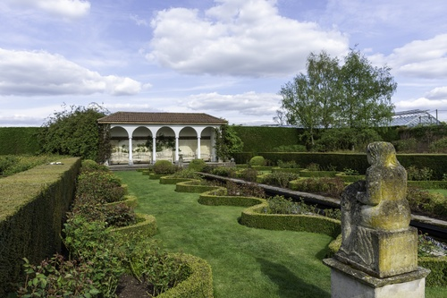
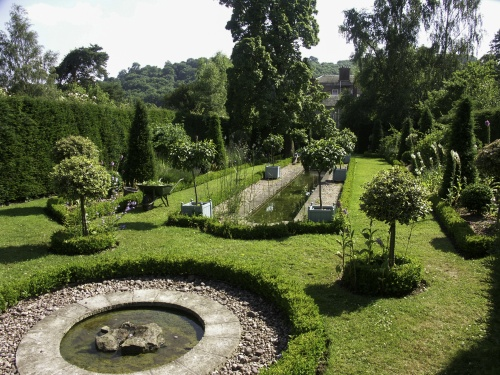
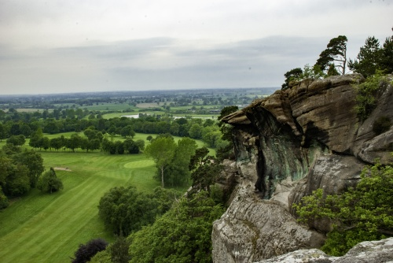
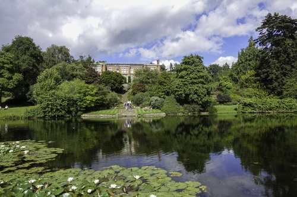
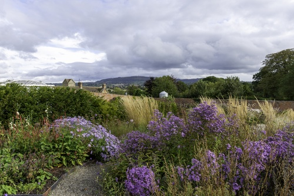
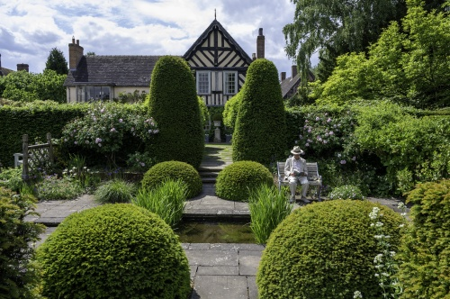

# Name: David Austin Rose Garden

The rose garden at David Austin Roses is considered by many to be one of the most beautiful in the world.  The garden covers an area of around 2 acres and there over 700 different varieties of rose planted in the various themed areas.

# Name: Dower House

The Dower House Garden is located within the grounds of Morville Hall (NT), the garden is about 1.5 acres in size.

The purpose of the garden is to tell the history of English gardening by presenting a series of individual gardens designed in the style of different historical periods.  The gardens are authentic in that the plants and construction techniques are in keeping with the period of the garden.

Work started on the garden in 1988 and has been designed by Dr Katherine Swift, the garden historian and writer.

The garden includes a Cloister Garden (c. 1450), a Knot Garden (c. 1580), a Canal Garden (c. 1710), a Victorian Rose Border (c. 1870) and a Turf Maze based on a design dating back to the Bronze Age.

# Name: Dudmaston House Garden

TBD

# Name: Hawkstone Park and Follies

During the 19th Century, Hawkstone Park and Follies was one of the most visited landscapes in Britain.  Hawkstone Park and Follies is set in 100 acres of parkland and is a range of natural sandstone hills that were developed to include gullies, caves, towers and bridges.  In the 20th Century the landscape became forgotten and overgrown.  It is now designated as a Grade I listed landscape by English Heritage, following a multi-million pound restoration project it reopened in 1993.

Richard Hill, King and Queen's Diplomat and Lord of the Treasury, inherited the estate in 1700.  Travels to the continent inspired him to make changes to Hawkstone - over the next 100 years the grounds were shaped with new terraces, tree lined walks, shell encrusted grotto and various Follies for visitors to explore.  Visitor numbers grew throughout the late 1700s and by 1800 Hawkstone was famous.

The grounds continued to be added to through the 1800s with new specimens of plants from all over the World.  However, the expanding estate began to exceed the family's finances, and in 1894 the last member of the Hill family to own Hawkstone was declared bankrupt.

# Name: Hodnet Hall Gardens

The gardens were created in 1922 when rare trees, shrubs and a chain of seven lakes and pools were established.

# Name: Oakgate Nursery and Garden

TBD

# Name: Weston Park Garden

TBD

# Name: Wildgoose Nursery and Garden

Formerly the brick walled kitchen garden of Millichope Park - the walled garden was built in the 1830s by the wealthy Rector of Church Stretton.

# Name: Wollerton Old Hall Garden

A 4 acre garden set around the 16th Century Hall.

