# Header: Precambrian Eon

The first of Shropshire's rocks are formed 700 to 555 million years ago, creating some of Shropshire's best known hills including the Wrekin, Caer Caradoc and the Long Mynd.  The rocks are part of the Vendian supercontinent (also know as Pannotia) and are located in the southern hemisphere, approximately 60 degrees south of the equator.

Towards the end of the Precambrian eon the supercontinent of Vendian starts to split (divided by the Iapetus Ocean), the rocks that would become Shropshire are now part of the Gondwana continent.

# Header: Cambrian Period

In the Cambrian period, Shropshire moves to 65 degrees south of the equator due to the widening of the Iapetus Ocean.

# Header: Ordovician Period

At the start of the Ordovician period, Shropshire (along with the rest of Southern Britain) formed part of the north-east margin of Gondwana.  During this period, a rift formed on the margin of the continent, creating the micro continent of Avalonia, and this new continent included Shropshire.  Avalonia starts to move northwards (at a rate of circa 2.4cm per year) as a new ocean (the Rheic Ocean) forms between Avalonia and Gondwana.

# Header: Silurian Period

The micro continent of Avalonia continued to move north during the Silurian period.  As it moved closer to the equator, the subtropial environment allowed coral reefs to grow on the northern margins of the continent, this resulted in the formation of the famous Much Wenlock limestone, circa 421 to 433 million years ago.

Perhaps the most famous rock formation in England, the Much Wenlock Limestone is known for its abundance of fossils, many of which were first recorded either in Shropshire or Worcestershire, and are found no-where else in the world.

# Header: Devonian Period

During the Devonian period, Shropshire lay close to the equator.  The county is now all bove sea level.

# Header: Carboniferous Period

TBD

# Header: Permian and Triassic Periods

TBD

# Header: Jurassic, Cretaceous and Tertiary Periods

TBD

# Header: Quaternary Period

TBD

# Header: Last Glacial Period

TBD

# Header: Paleolithic Age

The Paleothic Age (or early Stone Age, circa 100,000 to 10,000 BC)...

In general, late Paleolithic people were hunter/scavengers and food gatherers. They seem to have organized themselves around (more or less temporary) natural leaders (and followers) rather than establishing a more permanent "government".

# Header: Mesolithic Age

The Mesolithic Age (or middle Stone Age, circa 10,000 to 4,000 BC) is characterised by a warmer climate that changed the arctic environment to one of pine, birch and alder forest.  The improved climate led to the continuous human occupation of Britain.  The less open landscape was less conducive to the large herds of reindeer and wild horse that had previously sustained humans.  Those animals were replaced in people's diets by pig and less social animals such as elk, red deer, roe deer and wild boar, which would have required different hunting techniques.  Tools changed to incorporate barbs which could snag the flesh of an animal, making it harder for it to escape alive.  Farming was introduced to Britain at the end of Mesolithic Age around 4,500 BC, although hunter-gather ways of life continued it was being replaced by distinct territories occupied by different groups.

By about 6500 BC, rising seas had inundated the land bridge with Europe, making Britain an island.

In Shropshire flint scrapers and other implements from this age, and made out of local pebble flint, have been found primarily in the parishes of Worfield, Claverley and Alveley, along the South East border of the county.

# Header: Neolithic Age

TBD

# Header: Chalcolithic

## The Copper Age

TBD

# Header: c. 2500 BC to 800 BC

## The Bronze Age

Remains of Bronze Age settlements are not common in Britain and none have been recorded in Shropshire so far.  It is believed that many tribes led a nomadic lifestyle based on cattle and agriculture so did not build structures to last (communities were often based near rivers for transport).  There is evidence, however, of tree clearing at this time to make space for crops.

Tumuli (burial mounds) were built during this time on areas of high ground.  As well as providing a place to inter the cremated remains of their dead, the tumuli may also be where a tribe gathered at certain times of the year for religious purposes.  There are three known stone circles in Shropshire that date from this time at: Mitchell's Fold, Hoarstones and Whetstones (now destroyed).

# Name: Mitchell's Fold
- Date: Bronze Age

Sometimes called Medgel's Fold or Madges Pinfold, Mitchell's Fold is a Bronze Age stone circle.  Its true history is unknown.  This is one of three known stone circles in Shropshire.
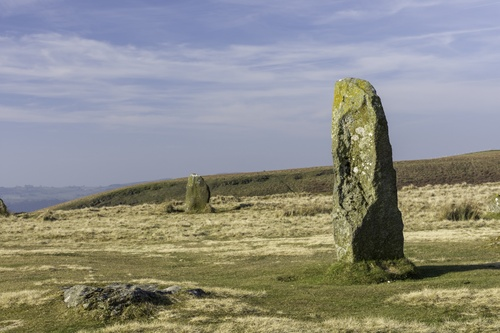

# Header: c. 800 BC to 43 AD

## The Iron Age

c. 500 BC - Celts inhabit much of Europe, and begin to colonize the British Isles.

The area now known as Shropshire was part of the territory of the Celtic Cornovii tribe (they also occupied the areas now known as Cheshire, Staffordshire north Herefordshire and parts of the eastern areas of Wales - areas now known Flintshire, Powys and Wrexham).

The capital of the tribe was most probably the Wrekin hill fort.  The first mention of the tribe occurs in the works of Ptolemy in the 2nd Century AD.  The origin of the name Cornovii is unknown, but it may mean 'People of the Horn' referring to a horned god cult followed by the tribe.

# Name: Old Oswestry Hill Fort
- Date: Iron Age

One of Britain's most spectacular and impressive early Iron Age hill forts.

The complexity of the defences suggests several phases of development.  After the hill fort was abandoned it was incorporated into Wat's Dyke (built by the king of Mercia in the early 8th Century, it preceded the better-known Offa's Dyke).
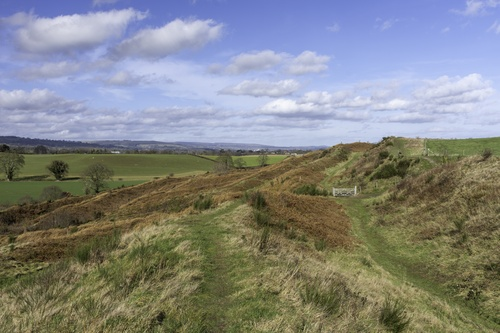

# Header: 43 AD

## The Roman invasion of Britain Begins

During the Roman occupation the tribe was reorganised as a Roman civitas (a social body of the cives, or citizens, united by law) and the capital was relocated to Viroconium.

# Name: Viroconium Cornoviorum
- Date: 55 AD

The site was first established in about AD 55 as a frontier post as it was strategically located near the end of the Watling Street Roman trunk road which ran across England from Dubris (Dover).  It was the fourth largest city in Roman Britain.

The site was abandoned around 88 AD as a fortress and was taken over as a civilian settlement and continued to be inhabited until the 7th century.

The ruin is noted for the 'the Old Work' (an archway, part of the baths' frigidarium and the largest free-standing Roman ruin in Britain).
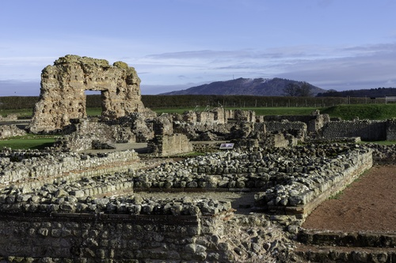

# Header: 410 to c. 450 AD

## Post-Roman Britain

In 407 the Roman troops in Britain are sent across the Channel into Gaul to defend that part of the Empire against the threats from the east. This left Britain without any protection, the Saxons took advantage and raided in 408 and 409 AD. Requests for aid were rejected by the Emperor in Rome, and so the Romano-Britains expelled the Roman officials.

Roman civic life continued, but declined (as the cities had lost their central function as centres for taxation and administration) and by about 450 AD the Roman economic system had broken down. Many of the Roman buildings at Viroconium Cornoviorum fall into disrepair and there is a substantial rebuilding programme in timber - who instigated this rebuilding is unknown, possibly a bishop.

# Header: c. 450 AD

## Anglo-Saxon settlement of Britain Begins

England is subject to successive invasions of Germanic tribesmen (Angles, Saxons and Jutes). Originally settling in eastern England, they moved progressively west as more arrived.

The Cornovian tribal area is under the rule of the Kingdom of Pengwern (little is known about Pengwern and how it came about, although according to Welsh tradition it was part of the Welsh kingdom of Powys). Early Powys, much larger in extent than the later medieval kingdom, is thought to have roughly coincided with the territory of the Cornovii tribe whose civitas capital or administrative centre was Viroconium Cornoviorum.

It is possible that the area of Shrewsbury was first settled in the 5th Century by refugees from Wroxeter. Also, at this time the king of Powys may have moved his court to the same area to resist the encroaching Anglian advances.

Wroxeter’s abandonment as a settlement cannot be precisely dated, however, but may have occurred in the mid sixth century, when a 'Great Plague' is known to have swept through Britain, or possibly in the seventh century, when the Anglo-Saxons took control of the region.

# Name: Battle of Maserfield, Oswestry
- Date: 641 AD or 642 AD

The Battle of Maserfield (or Maserfeld, "marsh (border) field"), was fought on 5th August 641 or 642, between the Anglo-Saxon kings Oswald of Northumbria and Penda of Mercia, ending in Oswald’s defeat, death, and dismemberment.

It is also thought that the Pengwern participated in the battle, as allies of Penda.

The battle left Penda (the Mercian king) as the most powerful king in England.

# Header: c. 642 AD

## Integration with Mercia

Evidence of Anglo-Saxon settlement in Shropshire is rare before the 7th Century.

Following a period of military alliance with Mercian rulers, particularly King Penda, Pengwern was absorbed by neighbouring Mercia after 642 AD (and the battle of Maserfield). The local Cornovian people may have continued to reside in the area, perhaps as the Wrekensaete, under Mercian rule.

It is likely that the Cornovii territory was partitioned and ruled by different princes, probably perpetuated in the ancient boundaries between the dioceses of Lichfield and Hereford.

Eventually, the northern part of Shropshire was part of the Anglo-Saxon territory of Wreocensaete (sometimes anglicised to Wrekinsets, the name approximates to Wrekin-dwellers) and the southern part of Shropshire probably belonged to the Magonsaete (a minor sub-kingdom of the greater Anglo-Saxon kingdom of Mercia).

The northern and southern parts of Shropshire were absorbed into the Saxon kingdom of Mercia by King Offa (Offa ruled Mercia from 757 to 796). In 765 AD he constructed Watt’s Dyke to defend his territory against the Welsh, and in 779 AD, having pushed across the River Severn, drove the Welsh King of Powys from Shrewsbury, he secured his conquests by a second defensive earthwork known as Offa’s Dyke.

The name "Mercia" is Old English for "boundary folk".

Shrewsbury was probably founded as a town in the 8th Century by the Saxon rulers of Mercia, who needed a fortified burh to control the Severn river-crossing on the road between the burhs of Hereford and Chester.

# Header: c. 7th Century AD

## Mercia converts to Christianity in the latter part of the 7th Century AD.

The first kings of Mercia were pagans, and they resisted the encroachment of Christianity longer than other kingdoms in the Anglo-Saxon Heptarchy.

Mercian rulers remained resolutely pagan until the reign of Peada in 656. The first appearance of Christianity in Mercia, however, had come at least thirty years earlier, following the Battle of Cirencester of 628, when Penda incorporated the formerly West Saxon territories of Hwicce into his kingdom, but Penda remained Pagan until his death.  Penda respected the Christians and even allowed them to operate more widely in Mercia.  However, not much progress was made in converting the nobles and people of Mercia.

The diocese of Mercia was founded in 656 by Diuma (the first Bishop of Mercia).

In 669 AD, the King of Mercia, Wulfhere, had requested a new bishop, as Mercia was without one following the death of the previous incumbent, Chad was dispatched by the Archbishop.  And so, after an inconclusive start, decisive steps to Christianise Mercia were being taken; Chad was the fifth bishop to minister to the Mercians and is credited with introducing Christianity to the Mercian kingdom.  Wulfhere gave Chad land to build a monasterary at Lichfield.

However, Mercia did not survive long as an ecclesiastical entity.  From 676 AD the Archbishop adopted a policy of appointing bishops to much smaller tribal groups within the kingdoms, thus covering smaller areas—closer in size to those found in other West European countries.  Hence, a bishopric (diocese) was established at Hereford (in 676 AD - one of the oldest in England) for the Magonsæte sub-kingdom (and the existing Lichfield diocese covered Wreocansaete).

# Name: St Chad
- Date: 669 AD

Chad became Bishop of Mercia in 669 and Wulfhere, first Christian king of Mercia, gave him land to establish his see at Lichfield.  Chad was outstanding for his humility and simplicity of life.  He died of the plague on 2 March 672.

He was at once venerated as a saint and his Shrine in the Cathedral of Lichfield was a place of pilgrimage throughout the Middle Ages.
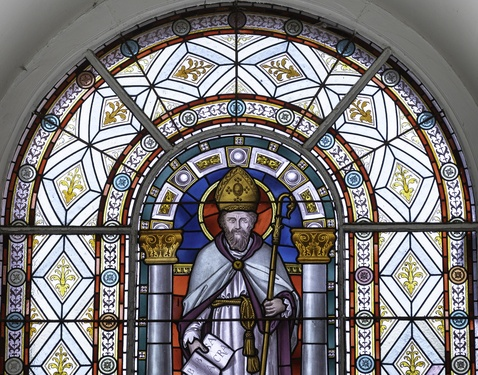

# Name: Wenlock Priory
- Date: c. 680 AD

The original Anglo-Saxon monastery was founded by the then King of Magonsaete (king Merewalh), his daughter quickly became its abbess (she was later canonised).  Wenlock Priory was the first monastery to be founded in Shropshire.

After Milburga's death circa 727 little is known of the monastery until the Norman conquest.

# Quote: County Day

Shropshire's county day is the 23rd February which is the feast day of St Milburga abbess of Wenlock Priory.

# Name: Offa's Dyke
- Date: Late 8th Century AD

In the late 8th Century, Offa's Dyke is constructed to delineate the border between Anglian Mercia and the Welsh Kingdom of Powys (it did not represent a mutually agreed boundary, rather it is believed to be a defensive earthwork or was built to demonstrate the power and intent of the Mercians).
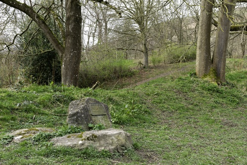

# Header: 878 AD

## Danelaw is Established

The Vikings had been raiding Britain since 792 AD, but being so far west, this had little impact on Shropshire until Danelaw was established.

Danelaw is established in 878 AD which divides Britain into the Anglo-Saxon south and the Danish north.

Although not part of the Danelaw, the area that is now known as Shropshire was regularly overrun by Danish raiders in the 9th and 10th Centuries, as the eastern part of Mercia had been seized by the Danes. In 874 the Danes destroyed the famous priory of Wenlock.

# Header: 879 AD to 1066 AD

## The end of Mercia

The final Mercian king died in 879 AD.  From about 883 to 911 AD Mercia was ruled by a Mercian Lord under the overlorship of Wessex.  Thus, the Kingdom of Mercia appears to have lost its political independence and was ruled by the kings of Wessex.  The last reference to Mercia by name is in the annal for 1017 AD, when Eadric Streona was awarded the government of Mercia by Cnut.  The Mercians as a people are last mentioned in the annal for 1049 AD.

Mercia was mapped out into shires in the 10th century after its recovery from the Danes by Edward the Elder (King of the Anglo-Saxons).

The first mention of "Shropshire" in the Anglo-Saxon Chronicle occurs under 1006 - this is when the King crossed the Thames and wintered in the area of Shropshire.

Thirteen years before the Norman Conquest, the Anglo-Saxon Chronicle relates that in 1053 the Welshmen slew a great many of the English wardens at Westbury, and in that year the English king ordered that any Welshman found beyond Offa's Dyke within the English shire should have his right hand cut off.

In the Domesday Survey, Earl Godwin, Sweyn, Harold, Queen Edith, Edward the Confessor and Edwin and Morcar (these are earls, kings and queens from Wessex and Mercia) are mentioned as having held lands in the county shortly before or during the Norman Conquest.

# Header: 1066 AD

## The Norman Conquest

The Norman conquest of Britain and start of Early Middle Ages (Medieval England).

After the Norman Conquest the principal estates of Shropshire were all bestowed on Norman proprietors, pre-eminent among whom is Roger de Montgomerie, 1st Earl of Shrewsbury.

Many new towns are established in the period from the Norman Conquest to the mid-13th Century and are a result of deliberate plantation.

# Name: Great Wollaston Castle
- Date: Norman

Great Wollaston castle is a Norman motte castle (also known as Beacon Hill), it is a well preserved example of a motte castle lying at the heart of an existing village.

# Name: Shrewsbury Castle
- Date: 1070 AD

Built by Roger de Montgomery as a defensive fortification for the town.  The town walls (of which little now remain) surrounded the town from castle.

Little of the original structure remains.  The castle was extensively repaired in 1643 during the Civil War before being acquired by Sir Francis Newport in 1663.  The castle was further repaired by Thomas Telford in 1780 on behalf of Sir William Pulteney.
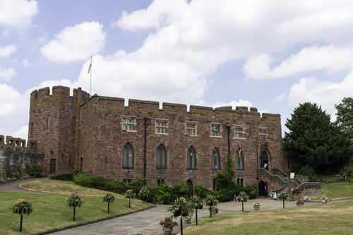

# Name: Roger de Montgomery, 1st Earl of Shrewsbury
- Date: 1071 AD

Roger de Montgomery is appointed Earl of Shrewsbury (the first to receive this title), although some historians believe he was not actually created Earl until 1074.  De Montgomery did not fight in the initial invasion of England in 1066, but was one of William the Conqueror’s principal counsellors.

He was one of the most powerful Marcher lords.  De Montgomery was also a great patron of monasticism, he became a monk in his newly founded Abbey of Shrewsbury just before he died in 1094.
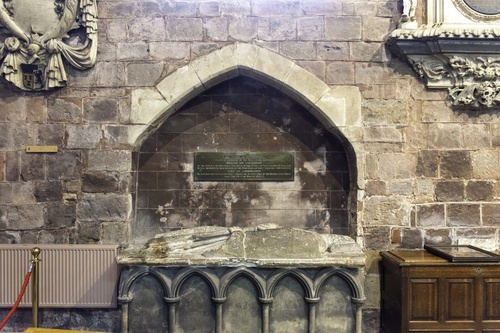

# Name: Ludlow Castle
- Date: 1075 AD

The castle is believed to have been founded by Walter de Lacy after the Norman Conquest and was one of the first stone castles to be built in England.

During the 12th and 13th Centuries the castle changed hands many times.  The Duke of York inherited the castle in 1425 and it was a symbol of Yorkist authority during the Wars of the Roses.  Then in 1461 ownership passed to the crown.

The castle was chosen as the seat of the Council in the Marches of Wales and so was effectively the capital of Wales.  Consequently, the castle was renovated throughout the 16th Century.

With the castle being besieged and taken by Parliamentary forces during the English Civil War and following the abolition of the Council in 1689 (after it had been restored following the English Civil War), the castle fell into neglect.

# Name: Shrewsbury Abbey
- Date: 1083 AD

The Abbey was founded in 1083 as a Benedictine monastery by the Norman Earl of Shrewsbury, Roger de Montgomery (who received Shropshire from William the Conqueror in 1071). It grew to be one of the most important and influential abbeys in England, and an important centre of pilgrimage.

Also known as the abbey church of St Peter and St Paul.

The abbey was one of the last to surrender (being at the end of the commissioners circuit) and was dissolved on 24th January 1540.

# Name: Oswestry Castle
- Date: 1086 AD

The first reference to this castle is in 1086 - the recording of castelle Lurve in the Domesday book as being built by the then Sheriff of Shropshire in the Hundred of Meresberie.

No town was recorded until 1272, although the Welsh were referring to Croes Oswald in 1254.

The castle was fought over and changed ownership many times during the conflict between the English and the Welsh.  By 1270 the castle's walls had been extended to encircle the town, but by this time the castle's military significance was in decline.

The castle was the scene of a parliament held by Richard II in 1398.

The castle was captured by Oliver Cromwell's troops in 1644, and by 1650 it had largely been demolished by the Roundheads.

# Header: 1086 AD

## The Domesday book is Completed

The Domesday book is a manuscript record of the "Great Survey" of much of England and parts of Wales, which was undertaken by order of King William the Conqueror.

# Name: Wenlock Priory
- Date: Late 11th Century AD

Wenlock was re-founded by the Normans as a priory of Cluniac monks in the late 11th Century by Roger de Montgomery. In 1101 it is reputed that Milburga's relics were discovered, attracting pilgrims and prosperity to the the priory allowing the impressive medieval priory to be built (which reflects the Cluniac love of elaborate decoration).

# Header: 11th & 12th Century AD

Many churches are built in the 11th and 12th Centuries - the church was massively endowed and its role all pervasive in medieval society.

Churches are listed on a separate page.

# Name: Bridgnorth Castle
- Date: 1101 AD

Founded in 1101 by Robert de Belleme (the second Earl of Shrewsbury, succeeding after his father Roger de Montgomery).

The main feature of the castle is the great square tower, built during the reign of Henry II.

During the English Civil War, Bridgnorth was one of the Midlands' main Royalist strongholds.  But following a three week siege Cromwell's Roundheads took Bridgnorth - Cromwell ordered that the castle be demolished and by 1647 little of the structure remained.  As a result, the remaining parts of the great tower now lean at an angle of 15 degrees (four times the lean of the tower at Pisa).

# Name: Buildwas Abbey
- Date: 1135 AD

A Cistercian monastery founded by a local bishop.  Sparse at the outset, the abbey did undergo several periods of growth and increasing wealth.  The abbey was a centre of learning and had a substantial library.  In the early days it was also noted fits its discipline.  The abbey was suppressed in 1536 as part of the Dissolution of the Monasteries.

# Name: St Winifred's Shrine
- Date: 19th September 1138 AD

Born probably between 610 and 620, Winefride resolved to dedicate her life to God by living a life of chastity and prayer.  Winefride was martyred as a teenager.  After her martyrdom, Winefride continued to live a holy life first as a hermit and then as a nun at Gwytherin, a remote place in Denbighshire.

In Shrewsbury, the abbey church was ready for consecration by 1130 but did not have any holy relics and the monks were envious of the many said to be in Wales.  The monks of Shrewsbury began negotiations to obtain the relics of St Winefride for their abbey.  With the consent of the Bishop of Bangor Herebert, the Abbot of Shrewsbury dispatched Prior Robert and another monk called Richard to Wales to obtain St Winefride's relics.  The relics of St Winefride were finally translated to the Abbey on 19th September 1138.  The shrine of Saint Winefride in Shrewsbury Abbey became a popular place of pilgrimage.  The shrine of Saint Winefride at Shrewsbury was destroyed in the reformation.  A fragment possibly of the shrine or of a reredos was recorded by the Rev. Blakeway in the early nineteenth century.
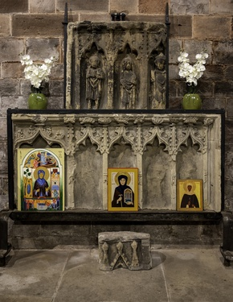

# Name: Lilleshall Abbey
- Date: 1145-1148 AD

The Abbey was founded around 1148 AD for a community of what is thought to be about 13 Augustinian canons from Dorchester Abbey in Oxfordshire.

During the 13th Century, the Abbey enjoyed great wealth and prestige - a respectable income was derived from a variety of sources, including even the tolls for the use of the Atcham Bridge.  The then king (Henry III) was entertained at the Abbey twice in about 1240 AD.

The Abbey suffered financial problems in the 14th Century (the abbott was accused of mismanagement).

The Abbey was closed in 1538, as part of the Suppression of the Monasteries.  The site then became a private dwelling until the mid-17th Century.

During the Civil War, the former Abbey buildings were severely damaged by Parliamentarian troops, at which point the site was abandoned and left to decay.

# Name: Malinslee Chapel
- Date: circa 1150 AD

Malinslee Chapel was a Norman chapel originally erected within the grounds of Malinslee Hall. The chapel was a small sandstone structure approximately 15 metres long, consisting of chancel and nave divided by a stone screen. Today, the remains of the chapel are located in the Telford Town Park.

The chapel had become a ruin by the 18th Century, probably before 1786, when Rev Williams produced a painting of the ruins. In 1909, the ruin was bought by Edward Parry, vicar of Malinslee, who proposed to restore it as a place of worship to designs by W. A. Webb, but nothing came of this. When Malinslee Hall was demolished in 1971 to make way for the new Telford Town Centre, the chapel was dismantled by the Telford Development Corporation and later re-assembled in the nearby Telford Town Park.

# Name: White Ladies Priory
- Date: 1186 AD

A priory of Augustinian canonesses who wore habits of undyed cloth.

Unusually for a monastic site, the buildings appear to be largely unaltered from the original.  The priory was never a large or wealthy house.

It was one of the first religious houses to be suppressed in 1535, after which most of the buildings were taken down and the site passed through various owners.

# Header: 12th Century AD

## The Marcher Lordships are Established

During the 12th Century the Marcher lordships emerge as almost independent states between the Welsh and English authorities.  The Marcher families were granted privileges by the English Crown which led to the exclusion of the judicial authority of the monarch and the Sheriff from their domains.

# Name: Clun Castle
- Date: 12th Century AD

Established by Robert de Say after the Norman invasion, Clun Castle was an important Marcher lord castle in the 12th Century.

Clun played a key part in protecting the region from Welsh attack, but the family (Fitzalan) gradually abandoned it as a property in favour of their more luxurious castle at Arundel.  The family converted the castle into a hunting lodge in the 14th Century, but by the 16th Century the castle was largely ruined.

# Name: Haughmond Abbey
- Date: 12th Century AD

Haughmond was an Augustinian monastery and was closely associated with the FitzAlan family (who became Earls of Arundel).

It was a successful and wealthy abbey.

The commission to dissolve the abbey was issued from Woodstock Palace on 23 August 1539 and signed by Thomas Cromwell.  A deed of surrender was drawn up on 19 September.  By 16 October, the abbot, the prior and 9 canons had signed to acknowledge Henry VIII as supreme over the Church of England.

The site was sold, some buildings were used as a private residence, others were plundered for building stone.  During the Civil War, fire further destroyed the site and it was turned over for use as a farm.

# Name: Moreton Corbet Castle
- Date: Circa 1200 AD

Originally known as Moreton Toret Castle, the stone structure was constructed to replace the probable fortified structure inhabited by Anglo Saxon thegns.  The name was changed to Moreton Corbet when Richard de Corbet inherited the castle in 1235.

The castle saw action in the English Civil War when it is known to have changed hands at least four times.

# Name: Alberbury Castle
- Date: 13th Century AD

The origins of the castle are uncertain but it was probably built in the 13th century by Fulk FitzWarin (a prominent representative of a marcher family associated especially with estates in Shropshire) during the reign of Richard I.

The main purpose of its construction appears to have been as a barrier to stop the Welsh onslaught and to retain control of the passes along the river Severn.

It is thought that the castle was razed by Llewellyn the Great in 1223, only to be rebuilt three years later in 1226, this time with a stone wall surrounding the bailey. A few years later the Sheriff of Shropshire ejected Fulk FitzWarin from the castle and took over his lands citing FitzWarin's utterances he made as a renunciation of fealty. However, Fitzwarin was able to retake his lands and his manor through the law. The FitzWarin family retained possession of the castle, although they moved their seat of power to Whittington after they secured it as a stronghold, until the mid fourteenth century, when it may have been abandoned.

# Name: Whittington Castle
- Date: 13th Century AD

The original castle was captured and destroyed by the King of Gwynedd in 1223 - after being returned to the English under the peace treaty it was rebuilt in stone, but was then ceded to the Welsh in 1267.  The castle remained in Welsh possession until 1276 when the castle became the residence of a powerful Marcher lord family.

# Name: Infirmary, Tong
- Date: mid-13th Century AD

The infirmary was constructed by the then owner of Tong castle as part remedy for a fine imposed on his father who rebelled against King John.  When the church and college was built in the 15th Century, the infirmary was incorporated into the college and enabled 13 alms people to be housed and looked after by the college priests.  After the Dissolution the infirmary remained as an Alms House, they were later demolished in 1764.

# Name: Ashfield Hall, Much Wenlock
- Date: 13th Century

Ashfield Hall is an historic house, consisting of two distinct portions. The left-hand side is the original 15th Century structure of coursed stone rubble with stone dressings, and the right-hand of timber frame and plaster was added late in the 16th Century.

The site was originally the site of St John's hospital, founded in the 13th Century for 'lost and naked beggars'.  The building was occupied in the 15th Century as the private house of the Ashfield family.  Later it was called the Blue Bridge Inn from the bridge over a stream that ran in front.  Charles I is believed to have stayed here in 1642 on his way from Shrewsbury to Oxford.

# Name: Hopton Castle
- Date: 1260s AD

It is believed that the castle was founded in the 12th century as a motte and bailey castle by one of the de Optons as a mesne lord of the Says of Clun Castle.  The family was politically significant, Sir Walter de Opton being Sheriff of the large, adjacent counties of Shropshire and Staffordshire.

It is most probable that Walter de Opton (over time becoming de Hopton) built the stone castle during the Barons' War of the 1260s.  The bailey was fortified in stone and the rectangular two-storey keep was built.

The last Walter Hopton died during the Wars of the Roses in the 15th century and the castle passed by marriage to the Corbet family of Moreton Corbet castle.
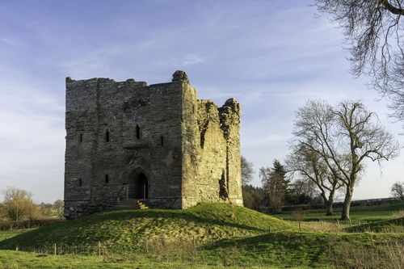

# Name: Cruck Cottage, Upton Magna
- Date: 1269 AD

This cottage is thought to be the oldest still-standing cruck cottage in England (and one of the oldest still-standing cruck cottages in Europe).  The Historic England listing suggests that the cottage dates from the 15th or 16th Century (and building does appear to have been remodelled in the 15th century), but dendrochronological tests on the crucks in the cottage have dated the timber to 1269.

# Name: Acton Burnell Castle
- Date: 1284 AD

Built in 1284 by Richard Burnell, Bishop of Bath and Wells, Acton Burnell Castle is a fortified manor house three storeys high which comprised hall, solar, bedrooms, offices, chapel and kitchen.  A benefit only extended to trusted people, Burnell as a friend and advisor to King Edward I, was granted a royal licence to crenellate and fortify the manor.

In the Autumn of 1283, it is believed that Edward I held a Parliament at Acton Burnell - this is significant because it was the first time in English history that the law making process included the Commons.  The law passed became known as the Statute of Acton Burnell, a law giving protection to creditors, indicating the increasing significance of traders during those times.

# Name: Stokesay Castle
- Date: 1280s AD

One of the first fortified manor houses in England, Stokesay Castle was built by Laurence of Ludlow.  It was built on the site of an earlier castle, some of which still survives.  Laurence of Ludlow was one of the leading wool merchants in England.

The gatehouse was added in 1640-1641, just before the English Civil War.  At that time Stokesay was owned by William Craven, the first Earl of Craven and supporter of the king.  The Royalist war effort collapsed in 1645, the castle was besieged and the Royalist garrison was forced to surrender.  The castle was ordered to be slighted by Parliament, but only minor damage was done allowing it to continue as a residence.
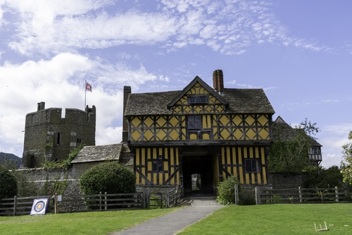

# Header: 1290 AD

## Start of the Later Middle Ages

# Name: Carmelite Friary, Ludlow
- Date: 1350 AD

Founded by Sir Laurence of Ludlow, the Carmelites were the last of the four chief orders of friars to reach Shropshire.

The convent of Carmelite friars was supressed in 1538 by Henry VIII and the friary buildings were sold and demolished.

In 1824 the site was opened as St Leonard's burial ground as the old medieval churchyard was completely full (and space here ran out in the First World War).  The chapel of rest was opened in 1871.
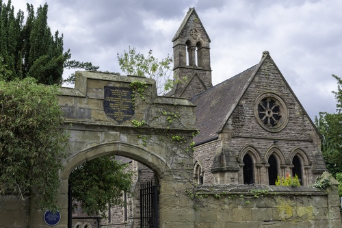

# Name: Hereford Mappa Mundi
- Date: circa 1300 AD

The Hereford Mappa Mundi is a medieval map of the known world (Latin: mappa mundi), of a form deriving from the T and O pattern, dating from c. 1300.  Archeological scholars believe the map to have originated from eastern England in either Yorkshire or Lincolnshire before it was transported westward to the Hereford Cathedral in Herefordshire where it has remained ever since.  It is the largest medieval map still known to exist.

The Hereford Mappa Mundi depicts Cleehill.
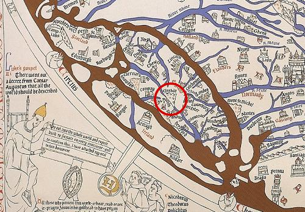

# Name: Shrewsbury Abbey Pulpit
- Date: 14th Century AD

The pulpit formerly stood in refectory of the Abbey of the Holy Cross.  Along with abbey church, the pulpit survived the dismantling of most of the abbey’s buildings following the dissolution of the monasteries.

# Name: Shrewsbury Town Walls Tower
- Date: 14th Century AD

The last remaining medieval watch tower of the fortified, defensive walls of Shrewsbury.  Used for observing the land around the town and the River Severn as the town was subject to attacks by the Welsh.

# Name: Battle of Shrewsbury
- Date: 21st July 1403 AD

The Battle of Shrewsbury was fought on 21st July 1403, between an army led by the Lancastrian King Henry IV and a rebel army led by Henry "Harry Hotspur" Percy from Northumberland.  The battle was the first in which English archers fought each other on English soil and reaffirmed the effectiveness of the longbow and ended the Percy challenge to King Henry IV of England.

The picture is of the statue of the king on the church at Battlefield.
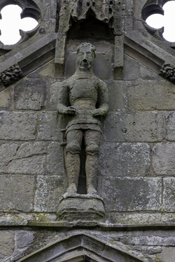

# Name: The Abbot's House, Shrewsbury
- Date: 1459 AD

A remarkably complete and significant surviving example of a late medieval town house.  It was built by the Abbot of Lilleshall as an investment for his abbey.  The trees used for the wooden frame were cut down in 1457-8.  Town bailiffs and the abbot's carpenter are mentioned in records as attending a frame raising ceremony in 1459. The ground floor was all shops.  The upper floors were tenements for people to live in.

# Name: Thomas 'Old Tom' Parr Born
- Date: 1483 AD

Thomas Parr was born at the Glyn in the township of Winnington within the chapelry of Great Wollaston (in the parish of Alberbury) in 1483.

According to the plaque he lived in the reigns of ten Kings and Queens of England and died on the 13th November 1635, aged 152 years and 9 months.  He is buried in Westminster Abbey.

A modern interpretation of the results of the autopsy suggests that Parr was probably less than 70 years of age.  It is possible that Parr's records were confused with those of his grandfather.

The brass plaque is in the church at Great Wollaston.

# Name: Henry Tudor House, Shrewsbury
- Date: mid-15th Century AD

71, 72 & 73 Wyle Cop - mid-15th Century timber-framed building with plain tiled roof, originally a dwelling but possibly also incorporating early shops.  There are 4 storeys to the lower section and 3 to the upper, divided by a central arch to passage.  Also known as Henry Tudor House, as on the front is a plaque recording that Henry VII stayed in the building in 1485 before the Battle of Bosworth Field.

# Name: Llwyd Mansion, Oswestry
- Date: Mid- to late 15th Century AD

The mansion was built in the mid- to late 15th Century AD, and remodelled in circa 1604 AD for John Lloyd (or Llwyd in Welsh) as a home and shop area at the bottom.
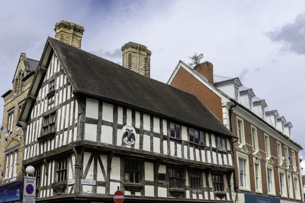

# Header: 1485 AD

## Start of the Tudor Age (and end of the Middle Ages / Medieval England)

# Header: c. 1500 AD

## Start of the English Renaissance

# Header: 16th Century AD

## The English Reformation

During the 16th Century the turbulence in the Marches was gradually suppressed and ended in 1536 with the statute incorporating Wales and England.  The lands of the Marcher lordships were brought under the jurisdiction of the county authorities.

# Header: 1534 AD

## The Church of England is Established

# Header: 1536 AD to 1541 AD

## The Dissolution of the Monasteries

Large areas of land came into new hands.  Schools were built to replace the educational function previously provided by the monasteries.  And many of Shropshire's most distinguished country houses were built in the late 16th Century and early 17th Century.

# Name: Much Wenlock Guildhall
- Date: 1540 AD

Although Much Wenlock received a charter from the King in 1468, local order was in the hands of the powerful Abbot of Wenlock Priory.  The Guildhall was built to provide a court (which remained in use until 1985) when the Priory was dissolved.  A Council Chamber was added in 1577.

The chambers are furnished with carved oak panels from a local manor house (installed in 1848) - no one knows which manor house or how they were available.
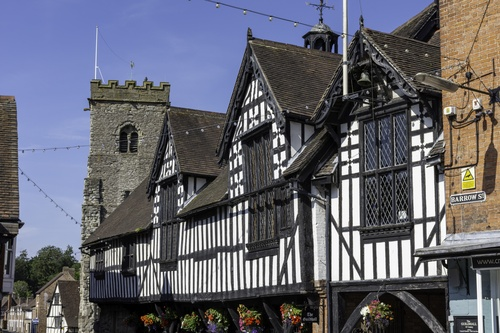

# Name: Morville Hall
- Date: 1546 AD

Originally an Elizabethan country house dating from 1546.  It was enlarged and expanded around 1750 by the then MP for Bridgnorth.

The house was once part of the Aldenham estate and stands on the site of the abandoned Morville Priory.

# Name: Shrewsbury School
- Date: 1552 AD

Shrewsbury School was founded in 1552 by Edward VI - the stone buildings were built 1594-1630.  Sir Philip Sidney, Judge Jeffreys and Charles Darwin were educated at this school.

# Name: Pitchford Hall
- Date: c. 1560 AD

The hall is considered to be one of England's finest Elizabethan half timbered houses.

The name derives from the nearby naturally occurring pitch, or bitumen, well (one of the few such wells in the country).

The present house was built for Adam Ottley, a Shrewsbury wool merchant, and possibly incorporated elements of the previous medieval structure.
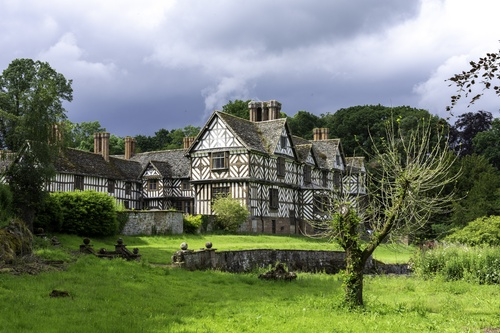

# Name: Ireland's Mansion
- Date: circa 1575 AD

The Ireland family were powerful wool merchants, some serving as Aldermen for Shrewsbury.  The Ireland mansion has been described as the most ambitious surviving 16th Century timber building in Shrewsbury.

# Name: Benthall Hall
- Date: 1580 AD

Built on the site of what was probably a 12th Century manor for the Benthall family.  The hall was garrisoned during the English Civil War and was the site of several skirmishes.
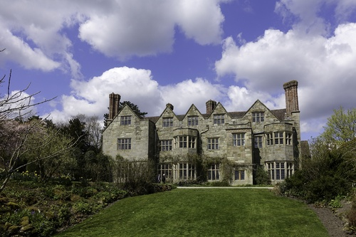

# Name: Wilderhope Manor
- Date: 1585 AD

The manor was built for Francis Smallman and remained in the family until 1734 when the estate was sold to Thomas Lutwyche..  It is believed that the manor house was not used as a main residence after the sale in 1734 and by 1936 was in a poor state and unoccupied.  It was donated to the National Trust on the condition it was used as Youth Hostel.

# Name: Shipton Hall
- Date: 1587 AD

Built to replace a timber framed house which had burned down.  The hall was largely rebuilt in the 18th Century, including the rococo interior decor which was created by the designer of the Iron Bridge.
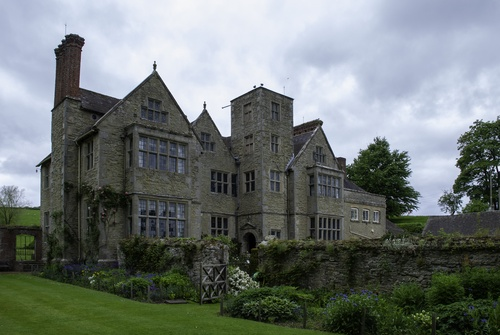

# Name: Old Market Hall, Shrewsbury
- Date: 1596 AD

The Old Market Hall is one of the earliest forms of pre-fabricated buildings, it was constructed in less than four months.  The large upper room was originally used by the Shrewsbury Drapers Company to sell Welsh cloth and the ground floor used by the farmers to sell corn.

# Name: Castle Gates House, Shrewsbury
- Date: Late 16th Century AD

The house was originally built on Dogpole, and was moved to its present position c1702 by the Earl of Bradford, its original site being developed with what is now the Guildhall.

# Name: Rowley's House, Shrewsbury
- Date: Late 1500s AD

Rowley's House was built by Roger Rowley - a wool merchant.  The house was built in the late 1500s.  The Mansion was built by his son in 1618 and is believed to be the earliest brick building in Shrewsbury.
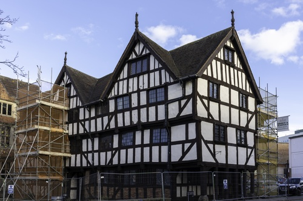

# Name: Moreton Corbet Mansion
- Date: 16th Century AD

The build of the Moreton Corbet manor was influenced by the classical architecture overseas as Robert Corbet, who started the build, spent time abroad in his role as a diplomat.  Robert Corbet died of the plague before the mansion was completed, his two brothers completed the building and left the remains of the original fortification as they were.

# Header: 1603 AD

## Start of the Stuart Age

# Name: The Reader's House, Ludlow
- Date: 1616 AD

Once the home of the bible reader for St Laurence's Church (bible reading was once a rare skill and so the position had prestige).

# Name: The Feathers, Ludlow
- Date: 1619 AD

Built by Rees Jones, a successful attorney in the town, who had frequently appeared before the Council of the Marches, which from 1536 until 1689 was situated in Ludlow, making the town in effect the capital of Wales.

The facade is decorated with Ostrich feathers which represented the Royalist support of the town for the Prince of Wales (who later became Charles I).  During the English Civil War the town remained loyal to the King and it is thought that Royalist Soldiers lodged at The Feathers during this time.

# Header: 1642 AD to 1651 AD 

## The English Civil War

The predominant opinion in the county of Shropshire was for the king.  Most towns in Shropshire were royalist; the main parliamentary centre was Wem.

Ludlow was the last royalist stronghold to fall in May 1646.

# Name: Lavington's Hole, Bridgnorth
- Date: 1646 AD

On 31st March 1646 during the Civil War, Bridgnorth was under siege from Parliamentary forces - the Royalists retreated to the castle after setting fire to the stables in Listley Street.  The fire soon spread to burn down many buildings in High Town.  It was the incendiary torches fired from the castle that ignited St. Leonards Church, burning all the town records that were stored in the church.  By 1st April 1646 most of Bridgnorth High Town was destroyed by the great fire.

After three weeks of continued attack on the castle Colonel Lavington took charge of getting a team of Parliamentary forces to dig a 70 foot tunnel under Castle Hill.  Knowing that the Royalists stored their gunpowder in St Marys Church, his aim was to blow up the church.

69 feet of tunnel was dug into the rock face but was not completed as the Royalists surrendered on Sunday 26th April 1646.
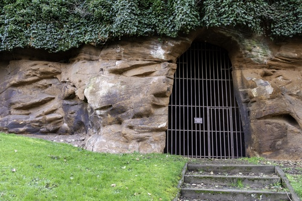

# Name: Bitterley Court
- Date: mid-17th Century

The original Manor House was built in the mid-17th Century.

The manor was remodelled in 1769 by Thomas Pritchard (the English architect and interior decorator who is best known for his design of the first cast-iron bridge in the world).
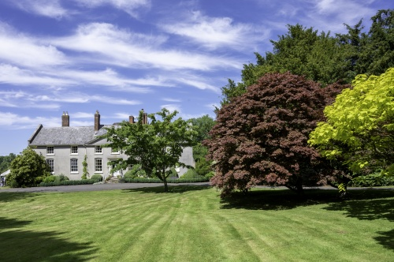

# Name: John Benbow Born
- Date: 10th March 1653 AD

Benbow joined the navy aged 25 years, seeing action against Algerian pirates before leaving and joining the merchant navy where he traded until the Glorious Revolution of 1688, whereupon he returned to the Royal Navy and was commissioned. Benbow fought against France during the Nine Years War, serving on and later commanding several vessels. He went on to achieve fame during campaigns against pirates and fighting in the West Indies against France during the War of the Spanish Succession.

Benbow's fame and success earned him both public notoriety and a promotion to admiral.  He was then involved in an incident during the action of August 1702, where a number of his captains refused to support him while commanding a squadron of ships. Benbow instigated the trial and later imprisonment or execution of a number of the captains involved, though he did not live to see these results. These events contributed to his notoriety, and led to several references to him in subsequent popular culture, including Treasure Island - the Admiral Benbow is the tavern where Jim Hawkins and his mother live.

# Name: J B Joyce & Co (Clock Maker) Founded
- Date: 1690 AD

J B Joyce & Co started making longcase clocks in Cockshutt.

The company claims to be the oldest clock manufacturer in the world.

In 1790 the firm moved to Whitchurch.  In 1964, Norman Joyce, the last member of the Joyce family, retired and sold the company to Smith of Derby.

Notable clocks include the Eastgate clock in Chester (1897) and the clock for the custom's house in Shanghai (1927).
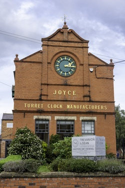

# Name: Pitchford Treehouse
- Date: 1692 AD

The treehouse is thought to be the oldest in the world, it is of circa 17th Century origin (first mentioned in 1692). It was given a new image in 1760 and was renovated again in 1980.  It is situated in a large leaved lime tree (Tilia Platyphyllos) and is constructed in the same style as the hall.

A part glazed door opens into the tree house to reveal a carved moulded cornice ceiling, stripped oak floor and gothic windows on all sides.  There is evidence that the restoration in 1760 may have been the work of the Shropshire architect Thomas Farnolls Pritchard.

Queen Victoria recorded in her diary that she watched a visiting pack of foxhounds from the treehouse during her visit to Pitchford Hall as a young princess.
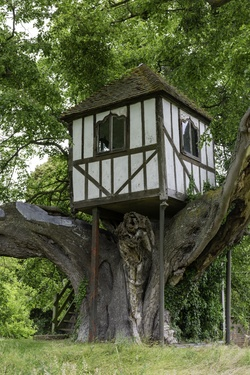

# Name: Dudmaston Hall
- Date: 1695 AD

The estate dates back to the 12th Century or earlier, it was acquired by the Wolryche family in the 14th Century.

The hall was built around 1695-1700 with some remodelling in the period from 1820 to 1840.

The house was built bu Sir Thomas Wolryche (3rd Baronet).

# Name: House on Crutches, Bishop's Castle
- Date: 17th Century AD

Now a museum, little is actually known of the origin and history of the building.  It is likely to have originally been a single room dwelling some time in the twelfth century.  Architectural features reveal that by the 1600s, the owners were very affluent.  The 'crutches' refer to the posts supporting a 17th century upstairs extension, giving more space without encroaching on the cobbled street which still passes underneath.

# Name: Old Furnace, Coalbrookdale
- Date: 1709 AD

Abraham Darby I successfully produces pig iron in a blast furnace fuelled by coke rather than charcoal.
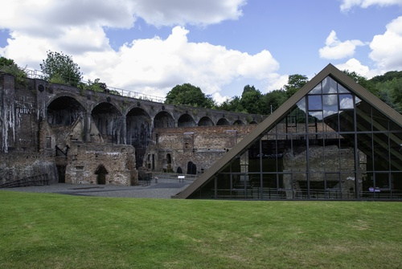

# Header: 1714 AD

## Start of the Georgian Period

# Name: Dale House, Coalbrookdale
- Date: 1717 AD

Built for Abraham Darby I, the house looks out over the Upper Furnace Pool whose outflow powered his blast furnace.

# Name: Clive of India Born
- Date: 1725 AD

Robert Clive was born at Styche, the Clive family estate, near Market Drayton in Shropshire, on 29 September 1725.

# Name: Burford House, Burford
- Date: 1728 AD

The house was commissioned by William Bowles who was a Whig politician and proprietor of the Vauxhall glassworks (the largest glass works in the country).

# Name: Rosehill, Coalbrookdale
- Date: 1738 AD

Built for Richard Fort who was Clerk to the Coalbrookdale Company under Abraham Darby I (and also his son in law), Fort later became the manager of the Coalbrookdale Ironworks.

# Name: Robert Cadman Dies, Shrewsbury
- Date: 1739 AD

Robert Cadman was an 18th Century steeplejack and ropeslider, between 1732 and 1739 he performed feats of daring by sliding or flying down a rope from St Mary's Church, Shrewsbury to the Gay Meadow across the River Severn. Cadman walked some 250 metres up the rope that connected the 68-metre-high spire of St Mary's Church with an anchor in the ground in Gay Meadow. Climbing up the rope across the River Severn, he performed tricks on the way. When at the top, near the pinnacle of the spire, he donned a wooden breastplate with a central groove and hurtled to earth along the rope.

On 2nd February 1739 he fell to his death when the rope broke. He was buried in St Mary's Church.

# Name: The Buttercross, Ludlow
- Date: 1746 AD

Considered to be the centre of Ludlow (and the highest point) and once the site of the High Cross, it was originally used as the butter market.

# Name: Bedlam Furnaces, Ironbridge
- Date: 1757 AD

The Bedlam Furnaces were built by the Madeley Wood Furnace Company between 1757 and 1759 - they are the most complete set of furnaces from this period in the country.  They were used to transform iron ore into molten iron, and were among the first to use coke as a fuel instead of charcoal.  The Bedlam Furnaces ceased operation in 1843 when the company moved production to the larger furnaces at Blists Hill.

# Header: 1760 AD to 1840 AD

## The Industrial Revolution

# Name: John Wesley First Sermon, 1 Fish St
- Date: March 16th 1761 AD

John Wesley preached his first sermon in Shrewsbury on March 16th 1761 at 1 Fish Street.  Wesley was an English cleric, theologian, and evangelist who was a leader of a revival movement within the Church of England known as Methodism. The societies he founded became the dominant form of the independent Methodist movement that continues to this day.
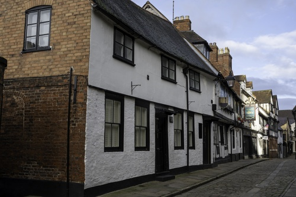

# Name: The Quaker Burial Ground, Coalbrookdale
- Date: 1763 AD

The first Abraham Darby (who introduced the use of coke pig iron as a feedstock for blast furnaces) was buried at Broseley in 1717.  His son, Abraham Darby II (who introduced the use of coke pig iron as a feedstock for finery furnaces), left provision for a piece of land in Coalbrookdale 'inclosed by a brick wall...for a burial place for such Friends who shall choose to be buried there...' - was the first to be interred there in 1763.  Also buried there are Abraham Darby III (builder of the Iron Bridge) and other influential members of the Society of Friends (such as Williams Reynolds).
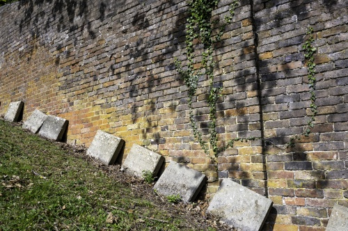

# Name: Town Hall, Bishop's Castle
- Date: 1765 AD

In common with other towns, Bishop's Castle had its own Guildhall, which in 1615 was described as being in a ruinous state.  The old Guildhall was demolished and replaced with the current Town Hall (in part using salvaged materials from the old building).

# Name: Atcham Bridge
- Date: 1769-1771 AD

There is a record of a bridge at Atcham as early as the 13th Century.  In 1550 Sir Rowland Hill funded the building of a stone bridge with 18 arches, this bridge was replaced by the present bridge which dates from 1769-71 (but may have been completed as late as 1776).  The bridge was designed by John Gwynn - Gwynn was born in Shrewsbury and was one of the founder members of the Royal Academy in 1768, his work includes Magdalen bridge in Oxford as well as several other bridges in Shropshire (one of which is the English bridge in Shrewsbury). 

# Name: Attingham Park
- Date: 1772 AD

Built from 1772 to 1785 for Noel Hill, 1st Baron Berwick, Hill was the politician who aided William Pitt the younger in the restructuring of the East India Company.

The house was designed by George Steuart and this is the only country house of his design still surviving.  At the time, the design was critised for its uncomfortably tall and almost barrack like facade and painfully thin portico columns.

In 1805 John Nash added the picture gallery, constructed using cast iron and curved glass, it was flawed from beginning as it suffered leaks.

# Name: Lord Rowland Hill Born
- Date: 1772 AD

General Rowland Hill, 1st Viscount Hill, served in the Napoleonic Wars as a trusted commander under the command of the Duke of Wellington, he became Commander-in-Chief of the British Army in 1828.  Hill was also Member of Parliament for Shrewsbury from 1812 to 1814 when he was raised to his peerage.

The column is the tallest Doric column in England at 133ft 6in, it commemorates Hill with a 17ft statue - the column was built between 1814 an 1816.  Following his death in 1842, Hill bequeathed monies to the person in charge of the column.

# Name: English Bridge, Shrewsbury
- Date: 1774 AD

A bridge is known to have stood at this spot since at least Norman times.  A bridge known as the "stone bridge" was completed in 1774.  The central arch of this bridge was built high to provide headroom for watercraft, but this resulted in steep arches.

A new design for the bridge was put forward in 1921, the intention being to widen the bridge and reduce its height.  The new bridge re-used the original masonry, as well as some new stonework.
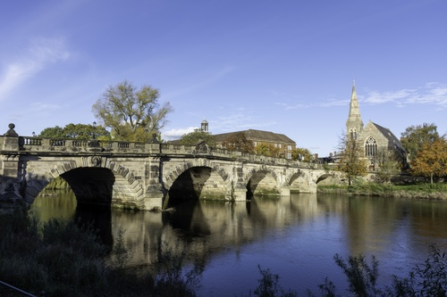

# Name: The Iron Bridge, Ironbridge
- Date: 1781 AD

Construction of the Iron Bridge started in November 1777 and completed in July 1779.  The bridge was opened to the public on 1st January 1781.

The bridge was proposed to link the industrial town of Broseley with the mining town of Madeley and the industrial centre of Coalbrookdale.

The bridge is to a carpenters' design typically used for wood structures.

# Name: The Toll House, Ironbridge
- Date: 1781 AD

The tollhouse opened for business on day the bridge was opened, New Year's Day 1781.  In 1934 the bridge was closed to vehicles; tolls for pedestrians ceased in 1950.

The Ironbridge Gorge Museum Trust acquired and restored the tollhouse building and opened it as a Tourist Information Centre in 1972.
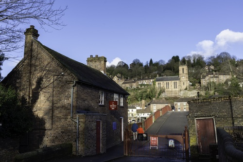

# Name: Thomas Telford arrives in the County
- Date: 1787 AD

A Scottish civil engineer, architect and stonemason, Thomas Telford, arrives in the county and is appointed Surveyor of the Public Works in Shropshire.

# Name: Tar Tunnel, Coalbrookdale
- Date: 1787 AD

A spring of natural bitumen which was discovered by accident when digging a tunnel for the Coalport Canal.  After digging 3,000ft of tunnel the canal project was abandoned (and the Hay Inclined Plane was built instead) in favour of bitumen extraction.

The tunnel was a great curiosity in the 18th Century.  The main use of bitumen at the time was to treat and weatherproof ropes and caulk wooden ships.

# Name: William Hazlitt House, Wem
- Date: 1787 AD

William Hazlitt is considered to be one of the greatest critics and essayists in the history of the English Language.

William Hazlitt lived at this house from 1786-1787 (during his childhood).

# Name: Shrewsbury Prison
- Date: 1793 AD

The original building was constructed by Thomas Telford to plans by a Shrewsbury architect.  The gatehouse is one of the few original features remaining, as in 1877 the prison was handed to the control of central governance and much of the prison was modernised and reconstructed as a result.

The name The Dana is still often used for the prison - the Dana Gaol was a medieval prison close to the site of the current establishment.

The bust of prison reformer John Howard is above the main entrance to the prison (Howard consulted on the construction of the prison).

The prison is famous for the high number of hangings that took place on its grounds - these took place from 1795 (the crime - theft of 10 handkerchiefs) to 1961 (the crime - robbery and murder).

# Name: The Hay Inclined Plane, Coalport
- Date: 1793 AD

The Hay Inclined Plane links the Shropshire Canal at Blists Hill with the Coalport canal basin (a short stretch of canal providing access to the River Severn).  The inclined plane was used to raise and lower the tub boats used on the canal to transport materials to and from the industrial area of Ironbridge.

The inclined plane traverses a height differential of 207ft, it was in operation from 1793 to 1894 and was formally closed in 1907.
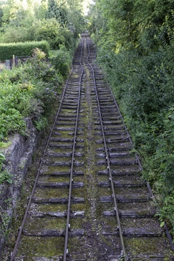

# Name: Welsh Bridge, Shrewsbury
- Date: 1795 AD

The bridge is built of Grinshill sandstone.

The bridge is 266 ft long and cost 8,000 pounds.

# Name: Coalport China Works
- Date: 1795 AD

The first porcelain factory in the Ironbridge Gorge.

# Name: Longdon-on-Tern Aqueduct
- Date: 1796 AD

Built by Thomas Telford, the cast iron aqueduct was designed to carry the Shrewsbury Canal over the River Tern.

Opened just a month after the first cast iron aqueduct on the Derby Canal.
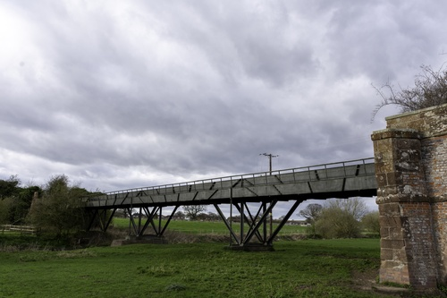

# Name: Ditherington Flax Mill, Shrewsbury
- Date: 1797 AD

The first iron-framed building in the world - as such it is considered to be the first skyscraper in the world.  Ditherington mill and a second mill at Castlefields provided the "chief manufacture" of Shrewsbury (according to an 1851 directory).

The flax mill closed in 1886, it was sold and converted to a maltings and continued to operate as such until 1987.

# Name: The Rotunda, Ironbridge
- Date: 1790s AD

Viewpoint and site of the Rotunda, which was a folly built by Richard Reynolds (who was a Quaker, philanthropista and partner in the ironworks at Coalbrookdale) in the 1790s as part of the "Sabbath walks" designed to take in the spectacular views of the gorge.  It was particularly for use by his workforce, but it was also used by visitors to the area.  It was demolished in February 1804, following the departure of Reynolds from the area a year earlier.  The rotunda was described by Joshua Gilpin (an American merchant and manufacturer who toured industrial Britain at the very end of the eighteenth century) in 1796 as a round temple of about 10 feet diameter with 'pillars of cast iron hollows' and in 1801 an unknown person refers to the rotunda as being supported by '9 iron pillars' - it was a circular structure a bit like a bandstand, inside it had revolving seat.
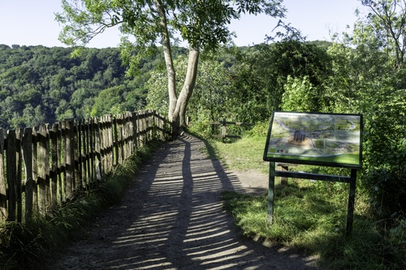

# Name: Cronkhill
- Date: 1802 AD

Designed by John Nash, it is thought to be the earliest Italianate villa in England.  It was built for Francis Walford, a friend of the 2nd Baron Berwick an agent for the Berwick's Attingham estates.
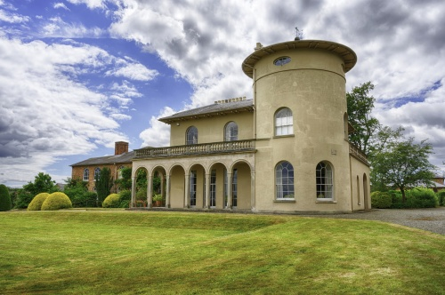

# Name: Canal Company, Ellesmere - Beech House
- Date: circa 1806 AD

In 1791 in Ellesmere a plan was proposed by a small group of industrialists who owned coal mines, iron mines and other works for a canal network to link the rivers Mersey and Severn. The hub was to be Ellesmere. Birch House was constructed to serve as the main office. From here Thomas Telford designed the tunnels, wharfs, moorings, locks and ‘rivers in the sky’. However the canal was never finished as intended due to the project’s rising costs and the failure to generate the expected commercial traffic.

# Name: Canal Company, Ellesmere - Canal Yard Workshop
- Date: circa 1806 AD

The dry dock and workshops constructed for the Canal Company.  English Heritage states this is the best-preserved canal workshop site in Britain.

# Name: Charles Darwin Born
- Date: 1809 AD

Charles Darwin was born in Shrewsbury on 12th February at his family's home, The Mount.

# Name: William Penny Brookes Born
- Date: 1809 AD

William Penny Brookes was an English surgeon, magistrate, botanist, and educationalist.  He established the Olympian Class of his Wenlock Agricultural Reading Society in 1850 to inspire local people to keep fit and take part in sports competitions.  Following the 1860 games, the Olympian Class was set up as the independent Wenlock Olympian Society.

Brookes' campaign for physical education brought him into contact with Baron Pierre de Coubertin - in 1890, the young French aristocrat visited Much Wenlock and stayed with Dr Brookes at his lifelong home in Wilmore Street.  Coubertin was inspired by discussions with Brookes and a games staged for his visit - in 1894 Coubertin set up the International Olympic Committee.

Consequently, Dr Brookes is credited as a founding father of the modern Olympic Games, and one of the Olympic mascots for London 2012 was named Wenlock after the town.
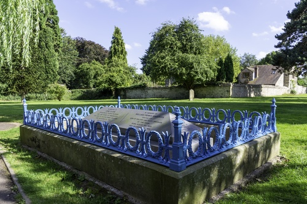

# Name: Bridgnorth Bridge
- Date: 1812 AD

A bridge was first recorded in 1272 when a man was killed on the bridge; also, a map of 1313 shows a bridge built of stone.  The present bridge is the result of repairs to the design and specification of Thomas Telford.

# Name: Cantlop Bridge
- Date: 1813 AD

Made of cast-iron, this bridge was part of an expanding network of bridges built to improve communication and trade in Shropshire.  The design was approved by Thomas Telford.  Unlike the Iron Bridge, built by Abraham Darby, Cantlop Bridge does not follow the design of a wooden bridge, as Telford recognised the strength of iron and engineered lighter frames that required less of this material.

Cantlop Bridge is the only Telford-approved cast-iron bridge remaining in situ in Shropshire.

# Name: Bridge, Coalport
- Date: 1818 AD

The first crossing of the river at Coalport was based on timber framed arches built on stone abutments and opened in 1780.  The opening was played down to not overshadow the showcase iron bridge further up the river.  The wooden bridge was destroyed by flooding in 1795.  The bridge was rebuilt in 1799, with brick, timber and cast iron parts.  By 1817 the bridge was failing again, and so the bridge was completely rebuilt in iron in 1818.

# Name: Stirchley Furnaces
- Date: 1820s AD

Originally built in the 1820s, the furnaces consisted of an ironworks, cinder hill, coke hearths, brickworks, engine pit, mount and pond.

The site was bought by the Old Park Iron Co. (which built the Stirchley Chimney) before selling the works to The Wellington Iron & Coal Co. in 1874.

In 1886 the site was leased to Thomas Groom who installed the Wrekin Chemical Works to produce charcoal from wood naphtha and tar.

# Name: Blists Hill Blast Furnace
- Date: 1832 AD

Three blast furnaces built by the Madeley Wood Company in 1832, 1840 and 1840 - they remained in use until 1912.  The furnaces replaced the two Bedlam blast furnaces - the completion of the Shropshire Canal and the building of the Hay Inclined Plane in the early 1790s provided a means of bringing in the raw materials and taking away the finished goods.
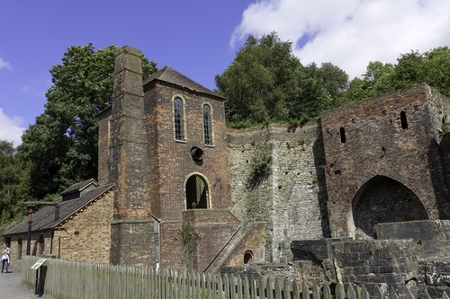

# Name: 1st Duke of Sutherland Monument, Lilleshall
- Date: 1833 AD

The Lilleshall monument was erected in 1833 and commemorates George Leveson-Gower (1st Duke of Sutherland), who died in that year. The obelisk is 70ft high. The construction was originally funded through £933.15s collected from the Duke's tenants, in recognition that he ‘went down to his grave with the blessings of his tenants on his head’. Originally there were two lions and two griffins at each corner, however these were damaged after a violent thunderstorm and were removed.
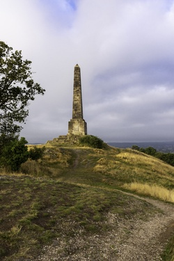

# Header: 1837 AD

## Start of the Victorian Age

# Name: Flounder's Folly
- Date: 1838 AD

Built by Benjamin Flouders to mark the boundaries between four large estates (and possibly the occasion of his 70th birthday).
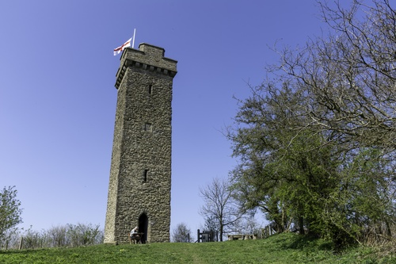

# Name: Music Hall, Shrewsbury
- Date: 1840 AD

The Music Hall was designed by Edward Haycock snr, it served as a music hall for 169 years.  It was then converted to the town's museum and art gallery.

# Name: Warehouse for Coalbrookdale Comapny
- Date: Around 1840 AD

Originally constructed as a warehouse for the Coalbrookdale Company, the building is now the museum of the gorge.

The building is in the Gothic Revival architectural style.
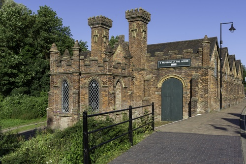

# Name: Millichope Glasshouses
- Date: 1841-1843 AD

Built when Millichope Park was owned by the wealthy rector of Church Stretton.  The cast iron frame reflects the thinking of the time in that the curved roof matches the curvature of the earth to increase sunlight.  It is likely that crops like pineapples, grapes and melons were grown in the glasshouse.

# Name: Tanners Wines
- Date: 1842 AD

Originally Thomas Southam & Son of Wyle Cop (and having an excellent reputation as wine merchants), the company was taken over by Tanners in 1936.

Tanners itself was established in 1872 by sea captain William Tanner and his brother - the cellars were those of the now demolished Victorian Market Hall and the offices were in Shoplatch.

# Name: Shropshire Union Railways and Canal Company Formed
- Date: 1846 AD

The company was formed by the amalgamation of the Chester Canal and the Birmingham and Liverpool Junction Canal and intended to convert a number of canals to railways.  However, due to a leasing arrangement with the LNWR the company lost its independence and was prevented from converting the canals.  Instead it focussed on managing the canals under its control.

The company was bought out by the LNWR in late 1922.
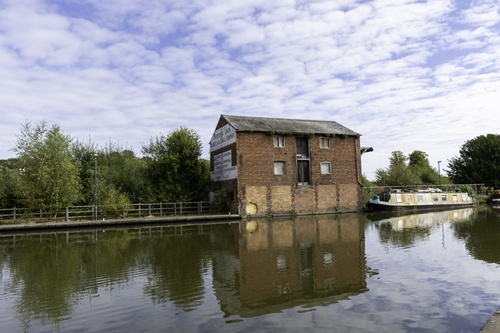

# Name: Matthew Webb Born
- Date: 1848 AD

Captain Webb was born in Dawley in 1848, he learned to swim in the River Severn at Coalbrookdale.

In 1875 he became the first recorded person to swim the English Channel without the use of artificial aids (in a time of less than 22 hours).  As a result, he became a celebrity, and performed many stunts in public.  He died trying to swim the Whirlpool Rapids below Niagara Falls, a feat which was declared impossible.  Webb was interred in Oakwood Cemetery, Niagara Falls, and in 1909 Webb's brother unveiled the memorial (drinking fountain) in Dawley.

# Name: Shrewsbury Station
- Date: 1848 AD

Formerly known as Shrewsbury General, the station was built for the county's first railway, the Shrewsbury to Chester line.  The building style is imitation Tudor with carvings of Tudor style heads around the window frames - this was done to match the Tudor building of Shrewsbury School.

# Name: Hospital of the Holy Cross, Shrewsbury
- Date: 1853 AD

Built by Daniel Rowland using the designs of Samuel Pountney Smith of Shrewsbury (who was also responsible for the rebuilding of Battlefield church during the same period), these almshouses are of the domestic Gothic style.  The almshouses are for "...for the residence of poor women aged 55 years or over who profess the Christian faith in accordance with the principles of one of the Protestant denominations..." and are endowed with lands and money to provide £10 yearly for each occupant.

Holy Cross is the name of the local parish, and Shrewsbury's Abbey church, which is just opposite these buildings and is the local parish church.
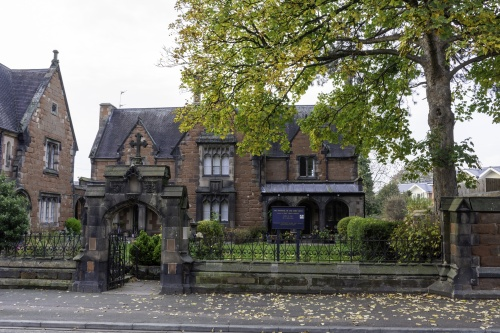

# Name: Coalbrookdale Viaduct
- Date: 1860s AD

The viaduct was built in the 1860s across Loamhole Brook and the Upper Furnace Pool to take the railway line from Lightmoor to Buildwas.

# Name: Bridgnorth Station
- Date: 1862 AD

There were great celebrations in the town when the station was opened.  Originally owned by the SVR Company, it then passed to the GWR Company and eventually to BR in 1948.  It closed to passengers and freight traffic in 1963.

The neo-Jacobean station is the only listed station on the SVR.
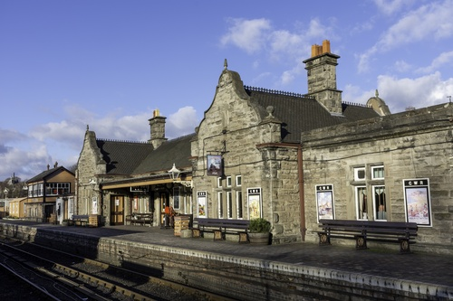

# Name: Jackfield Railway Gates
- Date: 1862 AD

The railway gates, located north-west of Calcutts House in Jackfield, were installed in 1862 as part of the Severn Valley Railway, which was opened on the 3rd January of the same year.  The railway was taken over by the Great Western Railway in 1863.  The gates are described as 'unusually large level crossing gates, which spanned sidings as well as the main running line', and are thought to be now the largest surviving in the UK.
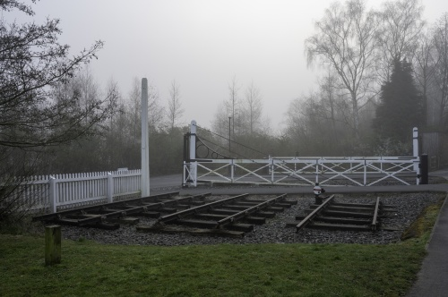

# Name: Shrewsbury Abbey Station
- Date: 13th August 1866

The station was opened as the temporary end of the Potteries, Shrewsbury and North Wales Railway (always known locally as ‘The Potts’).  In 1876 a railway carriage and wagon building works of the Midland Wagon Company operated next to the station. It closed in 1912.

Due to financial difficulties the station was closed on 22nd June 1880 when the railway could no longer continue services; a rare example of a railway closure in Britain in the 19th century.

Several attempts were made to reopen the railway and in the 1890–91 a start was made on remodelling the station before financial problems again caused work to cease.  The station was finally reopened on 13th April 1911 with a rebuilt line now known as the Shropshire and Montgomeryshire Railway.  It finally closed to passengers on 6th November 1933.

# Name: Royal Shrewsbury School Boat Club
- Date: 1866 AD

The Royal Shrewsbury School Boat Club (RSSBC) was founded in 1866 - the Boathouse is located opposite the Quarry Park.

The club is recognised as one of the leading rowing schools in the country, the school has achieved a number of wins at the Henley Royal Regatta.
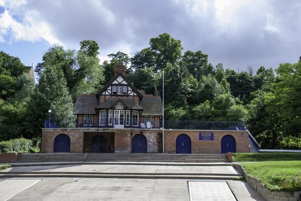

# Name: Morris Lubricants
- Date: 1869 AD

Morris Lubricants is one of the largest privately owned manufacturers of lubricants in Europe.  The company was founded in 1869 by James Kent Morris when he signed the lease on 7 Frankwell, the first Morris shop - a grocery business and candle factory.

# Name: William Clement Dies
- Date: 29th August 1870 AD

William Clement was a medical practitioner in Shrewsbury, he was an Honorary Fellow of the Royal College of Surgeons, a Fellow of the Society of Apothecaries, surgeon to the 1st battalion of the Shropshire Rifle Volunteers, and in actual practice as a surgeon.  He authored Observations in Surgery and Pathology and in 1834 was awarded the Fothergillian Gold Medal of the Medical Society of London.

He was also an Alderman, Mayor of Shrewsbury for 1861–62, a Deputy Lieutenant and J.P. for Merionethshire and a J.P. for Shrewsbury borough.  At the 1865 general election Clement was elected Member of Parliament for Shrewsbury.

# Name: Hodnet Hall
- Date: 1870 AD

The original timber framed manor house dates from some time before the late 16th Century.  Historically it was owned by the Heber family, the family of the noted English cleric Reginald Heber.  The old hall was demolished in 1870 when a new hall in the neo-Elizabethan style was built.

# Name: Craven Dunhill and Co Ltd, Jackfield
- Date: 1872 AD

Craven Dunhill and Co Ltd was formed on 9th February 1872 at Jackfield.  The firm became one of Britain's leading producers of ceramic tiles.

The new purpose built factory site, known as the 'Jackfield Works', was used by the firm from 25th February 1874.  Jackfield Works was constructed in the Gothic Revival style with a characteristic 'long and thin' plan, enabling raw clay to enter at one end, and finished products to emerge at the other.  Production ceased at the Jackfield Works 1951.
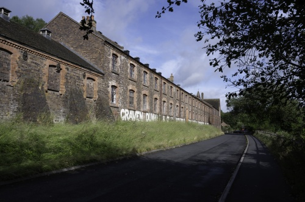

# Name: Stirchley Tower
- Date: 1873 AD

Built to serve the adjacent iron works (formerly Stirchley Furnaces), the chimney is approx. 209ft tall, and was built in Randlay brick by the Old Park Iron Co.

# Name: Bandstand, Shrewsbury
- Date: 1879 AD

The Bandstand was donated to the town park by the Shropshire Horticultural Society.  It consists of cast-iron columns, wrought-iron roof on stone base with vermiculated blocks and was cast by McDowell Steven and Co of Glasgow.
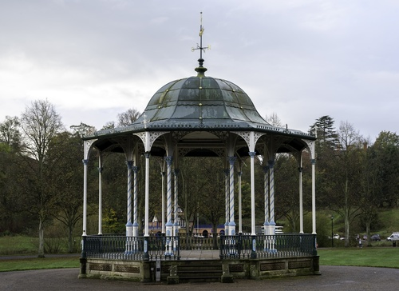

# Name: Cambrian Fossils
- Date: 1880s AD

At Comley Quarry near Church Stretton the first lower Cambrian fossils in England are discovered by Charles Callaway, and described by Charles Lapworth in 1888.
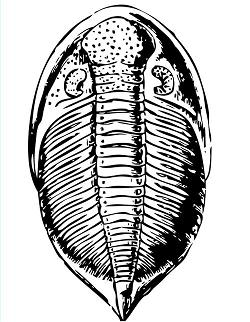

# Name: Sunnycroft
- Date: 1880 AD

A Victorian suburban villa - Sunnycroft is a rare example as it remains intact, complete with many of its original interior fixtures and fittings (many villas of this type have been changed out of recognition or replaced with more modern housing).
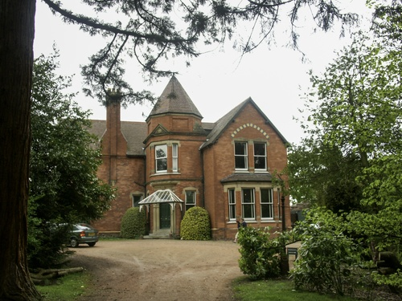

# Name: Mary Webb Born
- Date: 1881 AD

Mary Webb was a novelist and poet whose work is set mainly in the Shropshire countryside and features Shropshire characters and people.

Webb was born in Leighton in 1881.
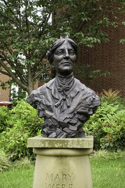

# Name: Margaret Rope Born
- Date: 1882 AD

Margaret Rope (born in Shrewsbury) was a stained glass artist in the Arts and Crafts movement. Although christened into the Anglican Church, she converted to Roman Catholicism in 1899 and later became a nun. Her stained glass was exclusively for churches, nearly all Roman Catholic. The Shrewsbury Cathedral has seven of her windows, including her first major commission (the west window).
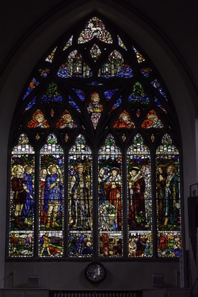

# Name: Maw & Co
- Date: 1883 AD

Maw & Co move to new premises at Jackfield.  The company was formed in 1850 and in 1852 relocated from Worcester to the Benthall Works (Broseley).  By the 1880s, Maw & Co had become one of the most influential and important tile manufacturers - the company was the first to use six or more colours on a tile, and embraced mechanical improvements to production, hence the need for a large bespoke site (at its height the factory produced over 20 million tiles per year).  The factory closed in January 1970.
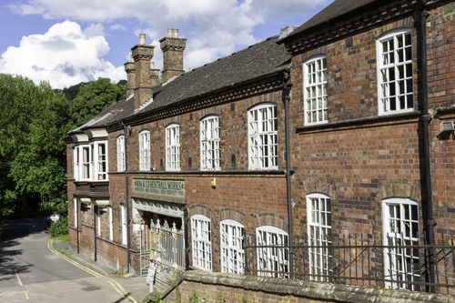

# Name: Broseley Pipe Works
- Date: 1880s AD

A local builder, Rowland Smitheman, took over a row of cottages which he then converted into workshops, built a coal fired bottle kiln and began to manufacture clay tobacco smoking pipes.

# Name: Henry Eckford arrives in Shropshire
- Date: 1888 AD

Henry Eckford was a Scottish horticulturist and reputedly the most famous breeder of sweet peas.  In 1888 he moved to Wem and it was in Wem that he perfected the breeding of his Grandiflora sweet peas.  He is buried at the Whitchurch Road Cemetery in Wem.

# Header: 1889 AD

## Salop County Council

Salop County Council is set up following the Local Government Act 1888.

# Name: Bridgnorth Cliff Railway
- Date: 1891 AD

The Bridgnorth Funicular Railway links the Low Town and High Town and was built as an alternative to the 200 steps linking the two towns.  It is one the steepest railways in the country - some claim it is both the steepest and the shortest.  Originally powered by water and gravity, it was electrified in 1944.  The original wooden cars were replaced in 1955 with stronger lighter ones with an aluminium monocoque.

# Name: Petton Hall
- Date: 1892 AD

Rebuilt in 1892 as a large neo-Elizabethan brick mansion, close to the site of the prior Petton Hall.

# Name: Wilfred Owen Born
- Date: 1893 AD

Owen was born on 18 March 1893 at Plas Wilmot, a house in Weston Lane, near Oswestry in Shropshire.

He was one of the leading poets of the First World War.

# Name: Arms of the Council Awarded
- Date: 1895 AD

The arms of the council were awarded in 1895 (the arms are derived from the arms of the county town, Shrewsbury).  
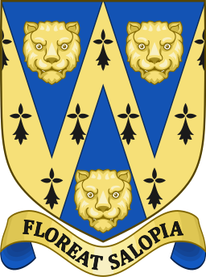

# Name: Dinham Bridge, Ludlow
- Date: 19th Century AD

Built to replace an older bridge at the same location.

# Name: Squatters Cottage
- Date: 19th Century AD

Areas of waste land were settled by squatters (landless men who built houses on common land) - this is known to have taken place from the early 16th Century until well into the 19th Century.

A government enquiry carried out in 1869 found that labourers' cottages were worse than in any other English county except Dorset.

# Name: Snailbeach Lead Mine
- Date: 19th Century AD

Although the first written evidence of lead mining at Snailbeach was in 1676, there is evidence of mining going back to Roman times.

Most of the present buildings were constructed in the period 1830 to 1880, when demand was at its greatest to meet the needs of the Industrial Revolution.

Mining ceased in 1955.

# Header: 20th Century

## Modern Britain

# Name: Harper Adams College
- Date: 1901 AD

Harper Adams College is founded after Thomas Harper Adams, a wealthy Shropshire gentleman farmer who had died in 1892, bequeathed the estate.

# Name: Titterstone Clee Hill Quarry
- Date: Early 19th Century AD Onwards

A number of quarries have existed on Titterstone Clee Hill.  Dhustone or basalt is quarried, which is used mainly as a construction aggregate.

# Name: Coleham Pumping Station
- Date: 1901 AD

The sewage pumping station was built as part of a major upgrading of Shrewsbury's sewerage system.  There are two massive steam-driven beam engines which were built by Renshaw's of Stoke-on-Trent in 1897-1898, and the brick building was erected in 1900.  The pumping station was opened in 1901 and the steam-powered pumps operated until 1970.

# Name: Richard Munslow Dies
- Date: 1906 AD

Richard Munslow is believed to be the last known 'sin-eater' in England.

# Name: Weir Built in the Shrewsbury Loop (the Middle Severn)
- Date: 1909 AD

The River Severn was a busy route for carrying raw materials and goods.  Up to the Victorian times the river was usually deep enough for the barges.  But throughout the 19th Century abstraction of water for domestic, agricultural and industrial use increased, reducing water levels such that by the early 20th century navigation with barges was impossible to manage with any reliability.

The weir at Shrewsbury was built in 1909 to keep the water level at a depth suitable for pleasure boats around the loop.

# Name: Clement Lloyd Hill Dies
- Date: 9th April 1913 AD

Sir Clement Lloyd Hill, KCB, KCMG was a British diplomat and Conservative Party politician.  He was appointed Superintendent of African Protectorates under Foreign Office in 1900, and retired in 1905, when supervision of British protectorates was transferred to the Colonial Office.  Hill was returned for Shrewsbury in 1906 as a Conservative, and was re-elected twice before dying in office in 1913, aged 67.  He was a great-nephew of British Army general Rowland Hill, 1st Viscount Hill.

# Name: RAF Shawbury
- Date: 1917 AD

First used in 1917 for military flying training by the RFC.  The station was closed in 1920, but was re-activated in 1938 as a training establishment and aircraft storage unit.

In 1944 Shawbury became the home of the central navigation school and in 1950 the school of air traffic control relocated to Shawbury.

In 1976 Shawbury also became the home of the basic and advanced helicopter training school. In 1997, the school was reformed as the Defence Helicopter Flying School providing training to all three of the UK's armed services.

# Name: Old Coracle Shed, Ironbridge
- Date: 1920s AD

The old coracle shed dates from 1920s, it is the last surviving coracle maker’s shed in England.

# Name: Memorial Bridge, Coalport
- Date: 1922 AD

The Memorial Bridge links the communities of Jackfield and Coalport, it was built to replace the fare-paying ferry boat.

A plaque on the bridge reads:

"1914 - 1918
The Great War
This bridge is free
O tread it reverently
In memory of those
Who died for thee
Erected by public subscription
1922"

# Name: Merrythought, Ironbridge
- Date: 1930 AD

Merrythought is established - the last remaining British teddy bear factory to continue to make its products in Britain.  The origin of the firm's name is unknown, but may derive from an archaic word for "wishbone".

Merrythought's most famous individual bear was probably "Mr Whoppit" which was the mascot of Donald Campbell.

# Name: RAF Cosford
- Date: 1938 AD

Opened originally as a joint aircraft maintenance, storage and technical training unit.  RAF Cosford has remained mainly as a training unit.  Training units currently stationed there include No. 1 School of Technical Training, No. 1 Radio School RAF, the Defence School of Photography and the RAF School of Physical Training.

# Name: RAF Clee Hill
- Date: September 1941 AD

In September 1941 a radar station was set up on Titterstone Clee (RAF Clee Hill), which housed 40-50 personnel.  Initially, the crew lived in huts on the hill, but from 1956 the crew were allowed to board in Ludlow due to the cold conditions in winter.  The station was closed in 1957, and was then reactivated in 1964 by the CAA.  The larger of the radar arrays is now part of the NATS radar network.  The smaller of the two is a Met Office weather radar station.

# Name: Morris Lubricants Clock, Shrewsbury
- Date: 1946 AD

The clock, which was made by J. B. Joyce & Co of Whitchurch, is wound every week by staff from the Morris Lubricants’ maintenance team.

The Clock Tower itself was built it 1876 and was part of the original Corbett’s Perseverance Ironworks, which was bought by Morris Lubricants in 1927.

# Name: Percy Thrower Moves to Shrewsbury
- Date: 1946 AD

Percy Thrower moved to Shrewsbury in 1946, taking the position of Parks Superintendent (the youngest to take this position).  He expected to stay only four or five years, but in fact remained in post until 1974.

# Name: Apley Castle is Dismantled
- Date: 1955 (18th November) AD

Apley Castle was a magnificent Georgian mansion house (similar to Attingham Park) and centrepiece of a 900 acre estate.  However, it became too expensive to maintain and so in 1955 the house was dismantled and the contents sold off.

Plans for the new house to replace the old house were approved in October 1791.  Costing 4622 pounds and 8 shillings, the contract stipulated that "The bricks to be made on the estate. Anything required to be taken from the old house, which at the same time is to be turned into the stables and outhouses."

The mansion was of the Georgian style with tall Corinthian pillars to its entrance porch, from which a drive of considerable length led to the town of Wellington.

Throughout the 19th century members of the family that owned the estate (the Charltons) distinguished themselves as soldiers in the Indian Wars and in the Crimea.  Whilst serving in India, Captain St. John Chiverton Charlton, an able botanist, is credited with the discovery of the tea plant, whose subsequent cultivation contributed much to the economic development of India.

# Name: Ironbridge B Power Station
- Date: 1963 AD

The first Ironbridge power station was opened in 1932, it was in operation until 1981 after which significant portions were demolished in 1983.

Construction of the Ironbridge B Power Station began in 1963, but due to construction delays, industrial action and the implementation of design improvements it didn't start feeding power into the National Grid until 1969.  The station stopped generating electricity in 2015 when it reached its 20,000 hours limit of generation under an EU directive.

# Name: Shire Hall, Shrewsbury
- Date: 1966 AD

The new Shire Hall for Shrewsbury was designed by Ralph Crowe, the County Architect.

Originally established as the headquarters of Shropshire County Council, the building became the offices of the new unitary authority, Shropshire Council in April 2009.

# Name: Telford New Town
- Date: 1968 AD

The new town of Telford is established.

# Name: David Austin Roses, Albrighton
- Date: 1969 AD

Austin began breeding roses in the early 1950s attempting to combine the characteristics of Old Roses and Hybrid Teas.  The first commercial specimen - Rosa Constance Spry - was created in 1961.  After that Austin went on to create over 200 new cultivars.

# Name: Cosford RAF Museum
- Date: 1979 AD

Originally a storage facility for the RAF museum at Hendon, the Cosford site was opened as a museum on 1st May 1979.  The museum initially exhibited airframes which had been used for technical training at RAF Cosford.  The museum was significantly expanded in the 1980s and 1990s.

In 2002 the RAF Museum Conservation Centre was relocated to Cosford.  The site now houses many very rare aircraft.

# Header: 1980 AD

## Shropshire

On the 1st April 1980 the name change to Shropshire comes into effect.

# Name: British Ironworks Centre, Oswestry
- Date: 1986 AD

The British Ironworks Centre and Shropshire Sculpture Park is a forge, silversmiths and sculpture park, famous for its safari park and gorilla made only of spoons.  The 12ft gorilla is made from 40,000 spoons donated from around the world.  Other notable sculptures are the 20ft knife angel made of knives handed in to police forces as part of an amnesty and four iron pavilions created in honour of the 60th anniversary of Queen Elizabeth II's coronation.

# Name: Telford & Wrekin Council Created
- Date: 1998 AD

In 1992 the Local Government Act authorised the creation of two unitary authorities, as a result Telford & Wrekin Council was created in 1998 - but remains part of the ceremonial county of Shropshire.

# Name: Quantum Leap, Shrewsbury
- Date: 8th October 2009 AD

The Quantum Leap was created to celebrate the bicentenary of the birth of Charles Darwin. It was unveiled on 8th October 2009 by Randal Keynes, a great-great-grandson of Darwin.

It also recognises Shropshire’s geological diversity as the county contains 10 of the 12 geological periods.

The sculpture consists of 59 segments, it measures 12 metres (40 feet) in height, 17.5 metres (57 feet) in length, and weighs more than 113 tonnes, excluding foundations and piles.

# Name: Replica Roman Villa, Wroxeter
- Date: 2011 AD

Built using authentic Roman techniques by a team of 21st Century builders and local volunteers, the project featured in the Channel 4 television series "Rome Wasn't Built in a Day".

# Name: Flag of Shropshire is Registered
- Date: 2012 AD

The flag of Shropshire was registered in March 2012.

# Name: Southwater, Telford
- Date: 14th July 2014

The first phase of Telford's £250million Southwater development opens.

# Name: Votes for Women, Coalbrookdale
- Date: 2018 AD

6 February 2018 marked 100 years since the passing of the Representation of the People Act 1918, which allowed women to vote in parliamentary elections for the first time.  To commemorate this an art installation was created in Coalbrookdale.

# Name: Telford 50th Anniversary
- Date: 2018 AD

The new town of Telford celebrates its 50th anniversary.

# Name: Bridge Restoration, Ironbridge
- Date: January 2018 AD

Local residents are invited to view the works being undertaken.

# Name: Bridge Restoration, Ironbridge
- Date: December 2018 AD

The Iron Bridge reopens after an extensive restoration and repair  project which took more than a year to complete.  The English Heritage project cost £3.6 million and returned the bridge to its original red-brown colour (which took 2400 litres of paint).

# Name: Cooling Towers Demolition, Ironbridge
- Date: 6th December 2019 AD

The cooling towers of the Ironbridge power station are demolished to make way for new housing.

# Name: Victory in Europe 75th Anniversary
- Date: 8th May 2020 AD

People across the county, like the rest of the country, commemorated the 75th Anniversary of Victory in Europe day by staying at home and living under the restrictions imposed due to the coronavirus pandemic.

# Name: Tommy Rogers Memorial, Ironbridge
- Date: 20th April 2021 AD

A memorial to Tommy Rogers is unveiled, he died in 1924 and was one of the last watermen to haul the barges and trows up the River Severn.  Tommy Rogers was grandfather to the Gorge's last coracle man, Eustace Rogers, who died in 2002.

# Name: The Queen's Platinum Jubilee
- Date: 2nd - 5th June 2022 AD

The Queen's Platinum Jubilee was celebrated across the county and the country.  Away from the pageantry, the village of Wrockwardine created a scarecrow trail!

# Name: Manchester Bee in Shrewsbury
- Date: 6th November 2022

The Manchester Bee visits Shrewsbury.

