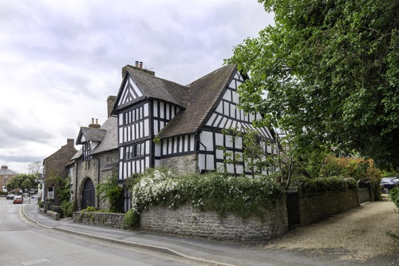
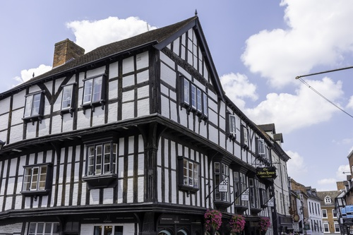
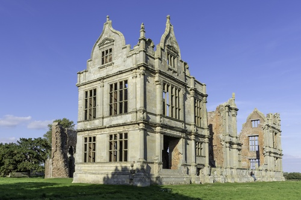
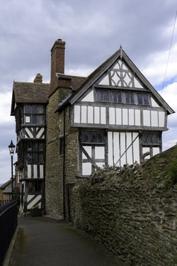
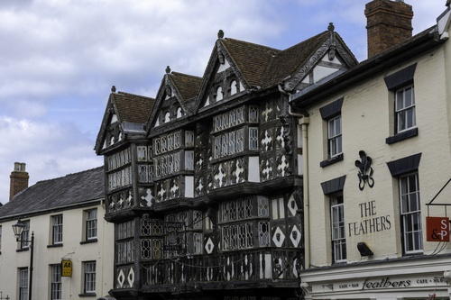
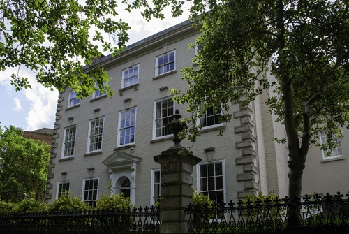
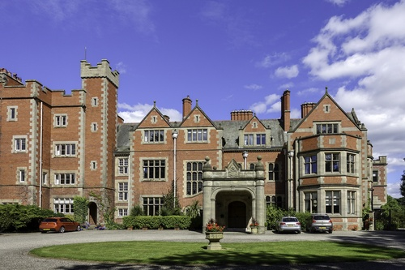

# Name: Cruck Cottage, Upton Magna
- Date: 1269 AD

This cottage is thought to be the oldest still-standing cruck cottage in England (and one of the oldest still-standing cruck cottages in Europe).  The Historic England listing suggests that the cottage dates from the 15th or 16th Century (and building does appear to have been remodelled in the 15th century), but dendrochronological tests on the crucks in the cottage have dated the timber to 1269.

# Name: Ashfield Hall, Much Wenlock
- Date: 13th Century

Ashfield Hall is an historic house, consisting of two distinct portions. The left-hand side is the original 15th Century structure of coursed stone rubble with stone dressings, and the right-hand of timber frame and plaster was added late in the 16th Century.

The site was originally the site of St John's hospital, founded in the 13th Century for 'lost and naked beggars'.  The building was occupied in the 15th Century as the private house of the Ashfield family.  Later it was called the Blue Bridge Inn from the bridge over a stream that ran in front.  Charles I is believed to have stayed here in 1642 on his way from Shrewsbury to Oxford.

# Name: Henry Tudor House, Shrewsbury
- Date: mid-15th Century AD

71, 72 & 73 Wyle Cop - mid-15th Century timber-framed building with plain tiled roof, originally a dwelling but possibly also incorporating early shops.  There are 4 storeys to the lower section and 3 to the upper, divided by a central arch to passage.  Also known as Henry Tudor House, as on the front is a plaque recording that Henry VII stayed in the building in 1485 before the Battle of Bosworth Field.

# Name: The Abbot's House, Shrewsbury
- Date: 1459 AD

A remarkably complete and significant surviving example of a late medieval town house.  It was built by the Abbot of Lilleshall as an investment for his abbey.  The trees used for the wooden frame were cut down in 1457-8.  Town bailiffs and the abbot's carpenter are mentioned in records as attending a frame raising ceremony in 1459. The ground floor was all shops.  The upper floors were tenements for people to live in.

# Name: Morville Hall
- Date: 1546 AD

Originally an Elizabethan country house dating from 1546.  It was enlarged and expanded around 1750 by the then MP for Bridgnorth.

The house was once part of the Aldenham estate and stands on the site of the abandoned Morville Priory.

# Name: Pitchford Hall
- Date: c. 1560 AD

The hall is considered to be one of England's finest Elizabethan half timbered houses.

The name derives from the nearby naturally occurring pitch, or bitumen, well (one of the few such wells in the country).

The present house was built for Adam Ottley, a Shrewsbury wool merchant, and possibly incorporated elements of the previous medieval structure.

# Name: Benthall Hall
- Date: 1580 AD

Built on the site of what was probably a 12th Century manor for the Benthall family.  The hall was garrisoned during the English Civil War and was the site of several skirmishes.

# Name: Wilderhope Manor
- Date: 1585 AD

The manor was built for Francis Smallman and remained in the family until 1734 when the estate was sold to Thomas Lutwyche..  It is believed that the manor house was not used as a main residence after the sale in 1734 and by 1936 was in a poor state and unoccupied.  It was donated to the National Trust on the condition it was used as Youth Hostel.

# Name: Shipton Hall
- Date: 1587 AD

Built to replace a timber framed house which had burned down.  The hall was largely rebuilt in the 18th Century, including the rococo interior decor which was created by the designer of the Iron Bridge.

# Name: Rowley's House, Shrewsbury
- Date: Late 1500s AD

Rowley's House was built by Roger Rowley - a wool merchant.  The house was built in the late 1500s.  The Mansion was built by his son in 1618 and is believed to be the earliest brick building in Shrewsbury.

# Name: Ireland's Mansion
- Date: circa 1575 AD

The Ireland family were powerful wool merchants, some serving as Aldermen for Shrewsbury.  The Ireland mansion has been described as the most ambitious surviving 16th Century timber building in Shrewsbury.

# Name: Castle Gates House, Shrewsbury
- Date: Late 16th Century AD

The house was originally built on Dogpole, and was moved to its present position c1702 by the Earl of Bradford, its original site being developed with what is now the Guildhall.

# Name: Moreton Corbet Mansion
- Date: 16th Century AD

The build of the Moreton Corbet manor was influenced by the classical architecture overseas as Robert Corbet, who started the build, spent time abroad in his role as a diplomat.  Robert Corbet died of the plague before the mansion was completed, his two brothers completed the building and left the remains of the original fortification as they were.

# Name: Llwyd Mansion, Oswestry
- Date: 1604 AD

The mansion was built in 1604 for John Lloyd (or Llwyd in Welsh) as a home and shop area at the bottom.

# Name: The Reader's House, Ludlow
- Date: 1616 AD

Once the home of the bible reader for St Laurence's Church (bible reading was once a rare skill and so the position had prestige).

# Name: The Feathers, Ludlow
- Date: 1619 AD

Built by Rees Jones, a successful attorney in the town, who had frequently appeared before the Council of the Marches, which from 1536 until 1689 was situated in Ludlow, making the town in effect the capital of Wales.

The facade is decorated with Ostrich feathers which represented the Royalist support of the town for the Prince of Wales (who later became Charles I).  During the English Civil War the town remained loyal to the King and it is thought that Royalist Soldiers lodged at The Feathers during this time.

# Name: Dudmaston Hall
- Date: 1695 AD

The estate dates back to the 12th Century or earlier, it was acquired by the Wolryche family in the 14th Century.

The hall was built around 1695-1700 with some remodelling in the period from 1820 to 1840.

The house was built bu Sir Thomas Wolryche (3rd Baronet).

# Name: House on Crutches, Bishop's Castle
- Date: 17th Century AD

Now a museum, little is actually known of the origin and history of the building.  It is likely to have originally been a single room dwelling some time in the twelfth century.  Architectural features reveal that by the 1600s, the owners were very affluent.  The 'crutches' refer to the posts supporting a 17th century upstairs extension, giving more space without encroaching on the cobbled street which still passes underneath.

# Name: Bitterley Court
- Date: mid-17th Century

The original Manor House was built in the mid-17th Century.

The manor was remodelled in 1769 by Thomas Pritchard (the English architect and interior decorator who is best known for his design of the first cast-iron bridge in the world).

# Name: Dale House, Coalbrookdale
- Date: 1717 AD

Built for Abraham Darby I, the house looks out over the Upper Furnace Pool whose outflow powered his blast furnace.

# Name: Burford House, Burford
- Date: 1728 AD

The house was commissioned by William Bowles who was a Whig politician and proprietor of the Vauxhall glassworks (the largest glass works in the country).

# Name: Rosehill, Coalbrookdale
- Date: 1738 AD

Built for Richard Fort who was Clerk to the Coalbrookdale Company under Abraham Darby I (and also his son in law), Fort later became the manager of the Coalbrookdale Ironworks.

# Name: Attingham Park
- Date: 1772 AD

Built from 1772 to 1785 for Noel Hill, 1st Baron Berwick, Hill was the politician who aided William Pitt the younger in the restructuring of the East India Company.

The house was designed by George Steuart and this is the only country house of his design still surviving.  At the time, the design was critised for its uncomfortably tall and almost barrack like facade and painfully thin portico columns.

In 1805 John Nash added the picture gallery, constructed using cast iron and curved glass, it was flawed from beginning as it suffered leaks.

# Name: William Hazlitt House, Wem
- Date: 1787 AD

William Hazlitt is considered to be one of the greatest critics and essayists in the history of the English Language.

William Hazlitt lived at this house from 1786-1787 (during his childhood).

# Name: Cronkhill
- Date: 1802 AD

Designed by John Nash, it is thought to be the earliest Italianate villa in England.  It was built for Francis Walford, a friend of the 2nd Baron Berwick an agent for the Berwick's Attingham estates.

# Name: Hodnet Hall
- Date: 1870 AD

The original timber framed manor house dates from some time before the late 16th Century.  Historically it was owned by the Heber family, the family of the noted English cleric Reginald Heber.  The old hall was demolished in 1870 when a new hall in the neo-Elizabethan style was built.

# Name: Sunnycroft
- Date: 1880 AD

A Victorian suburban villa - Sunnycroft is a rare example as it remains intact, complete with many of its original interior fixtures and fittings (many villas of this type have been changed out of recognition or replaced with more modern housing).

# Name: Petton Hall
- Date: 1892 AD

Rebuilt in 1892 as a large neo-Elizabethan brick mansion, close to the site of the prior Petton Hall.

