# Intro: Miscellaneous

Bitterley church and Titterstone Clee hill.

A panaromic view of Lilleshall.

A view when driving from Clun to Hopton Castle.

A different view of Hopton Castle.

View of Whitcliffe Common and the castle from the top of St Laurence's tower, Ludlow.

The River Teme as seen from Offa's Dyke near Knighton.

# Name: Bitterley

The church and Titterstone Clee hill.
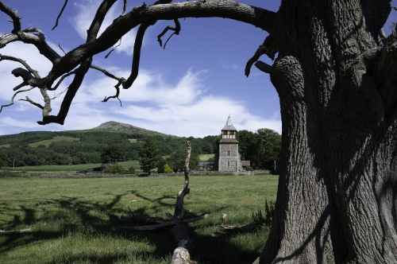

# Name: Lilleshall

A panaromic view of Lilleshall.
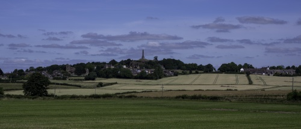

# Name: Shropshire - General View 1

A view when driving from Clun to Hopton Castle.
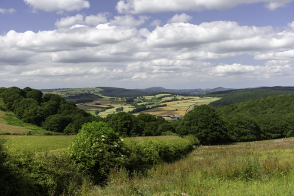

# Name: Hopton Castle

A different view of Hopton Castle.
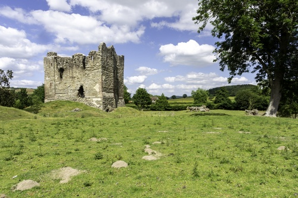

# Name: View of Whitcliffe Common and the castle from the top of St Laurence's tower, Ludlow

TBD
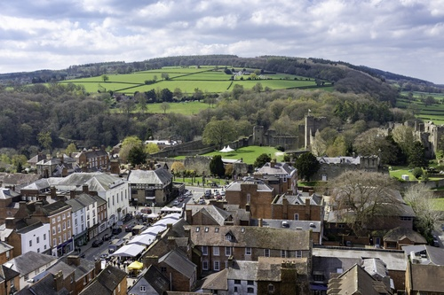

# Name: The River Teme

The River Teme as seen from Offa's Dyke near Knighton.
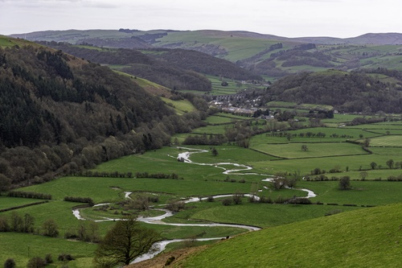

# Intro: Caer Caradoc

TBD

# Name: Caer Caradoc

TBD
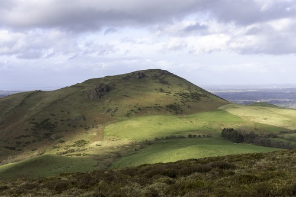

# Intro: Callow Hill

Flounder's Folly is on Callow Hill.

# Name: View from Flouder's Folly, Callow Hill

TBD
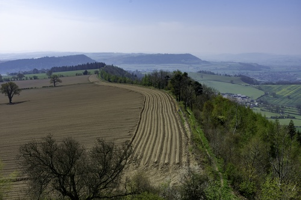

# Name: View from Flouder's Folly, Callow Hill

TBD
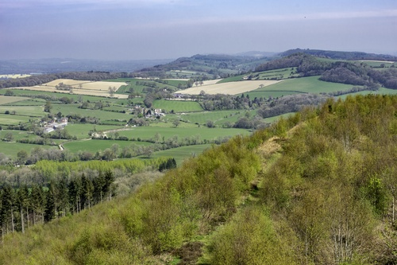

# Name: Flouder's Folly and Callow Hill

TBD
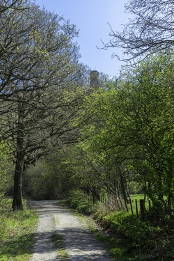

# Intro: The Hollies

The Hollies nature reserve (at The Stiperstones above Snailbeach).  The reserve is a scattered grove of ancient holly trees, some of the trees are 300 or 400 years old.

Rowan trees can also be seen growing next to the holly trees, in some cases the rowan trees are rooted inside the holly trees.  This is because birds such as redwings, fieldfares and winter thrushes eat the rowan berries and then deposit the seeds when perched on the holly trees.

# Name: The Hollies

TBD
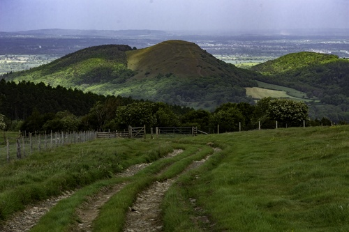

# Name: The Hollies

TBD

# Name: The Hollies

TBD
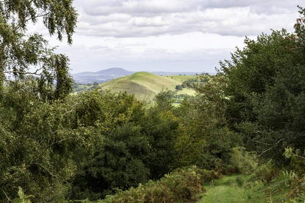

# Intro: Hope Bowdler Hill

The Gaer Stone.

# Name: The Gaer Stone, Hope Bowdler Hill

TBD

# Intro: The Long Mynd

TBD

# Name: The Long Mynd

TBD
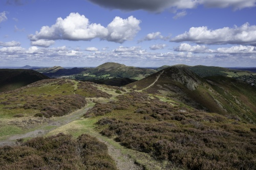

# Name: The Long Mynd

TBD
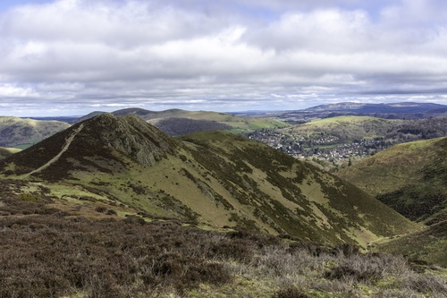

# Name: The Long Mynd

TBD
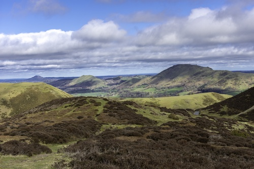

# Name: The Long Mynd

TBD
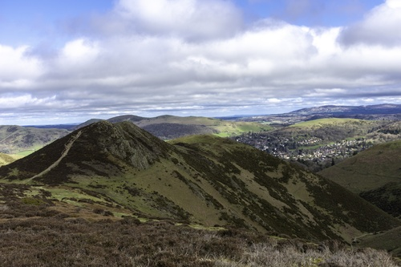

# Name: The Long Mynd

TBD
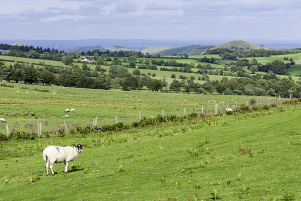

# Name: The Long Mynd

TBD
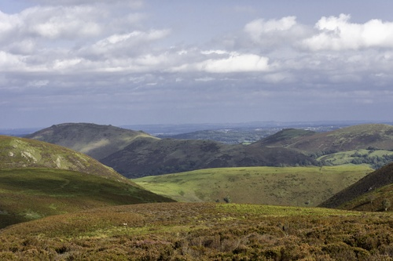

# Name: The Long Mynd

TBD
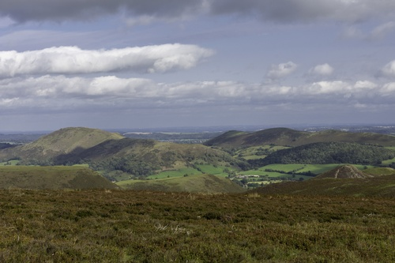

# Name: The Long Mynd

TBD
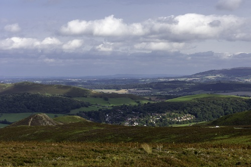

# Name: The Long Mynd

TBD
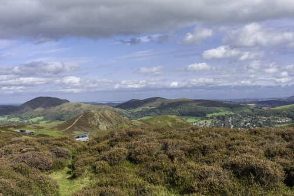

# Name: The Long Mynd

TBD
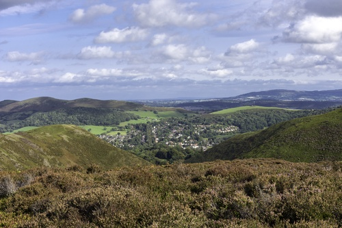

# Name: The Long Mynd

TBD
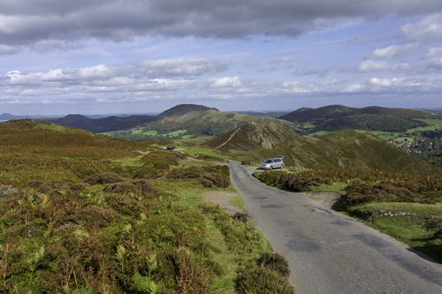

# Name: The Long Mynd

TBD
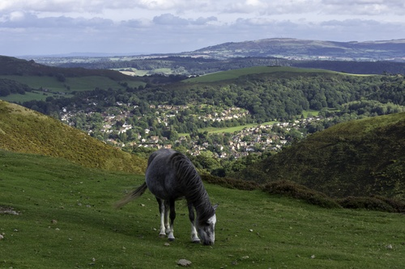

# Name: The Long Mynd

TBD
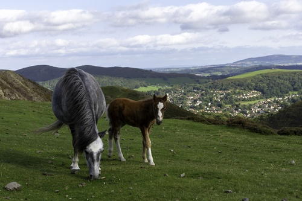

# Name: The Long Mynd

TBD
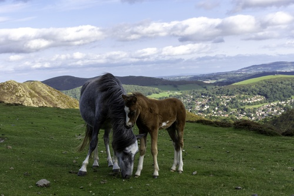

# Name: The Long Mynd

View of Church Stretton.
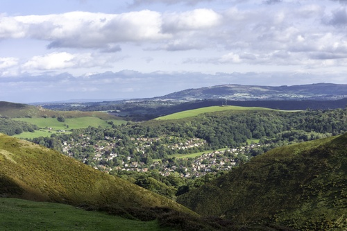

# Name: The Long Mynd

TBD
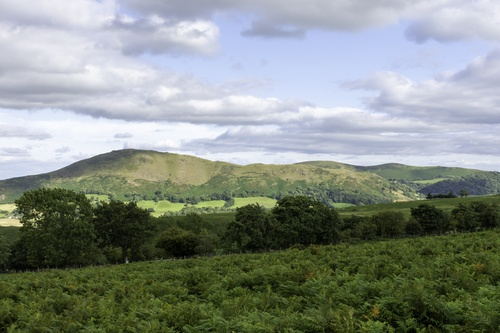

# Name: The Long Mynd

TBD
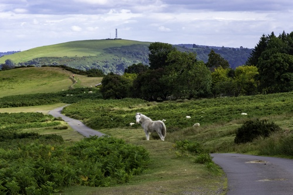

# Name: The Long Mynd

TBD
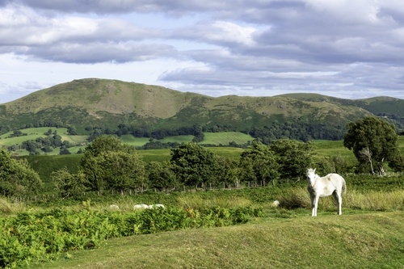

# Name: The Long Mynd

View of the Stiperstone ridge from Pole Bank.
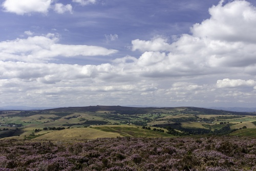

# Name: The Long Mynd

TBD
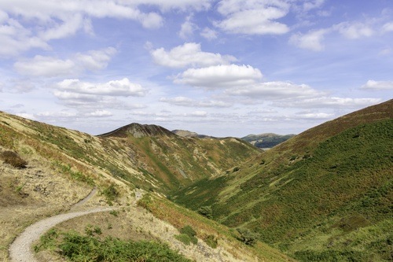

# Name: The Long Mynd

TBD
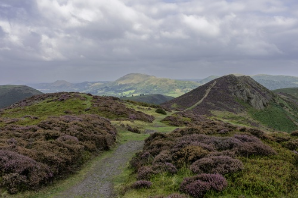

# Name: Ashes Hollow, The Long Mynd

TBD
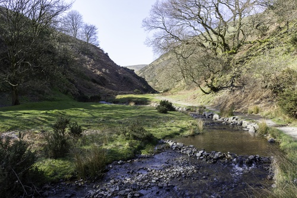

# Name: View of Caer Caradoc and Church Stretton from Small Batch, The Long Mynd

TBD
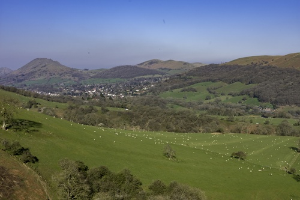

# Name: View of Caer Caradoc and Church Stretton from Small Batch, The Long Mynd

TBD
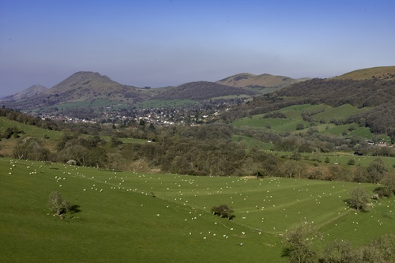

# Name: View of Ragleth Hill and Little Stretton from Small Batch, The Long Mynd

TBD
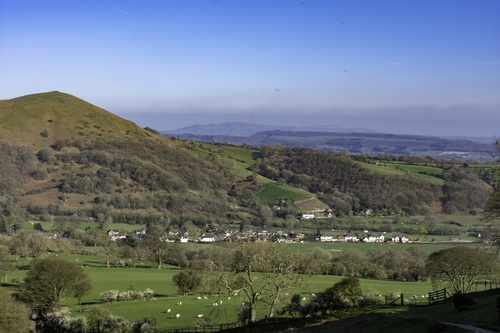

# Intro: Titterstone Clee Hill

Titterstone Clee is third highest hill in Shropshire.  It is one of only a few hills and mountains noted on the Hereford Mappa Mundi (13th Century map of the world).

In medieval times ironstone and, later, coal were mined, in particular from bell pits (localised mine shafts), one of which is now flooded forming a lake.

The hill fort on Titterstone Clee is of note as the walls of the fort are made of stone blocks instead of earth banks.  The hill fort dates back to the late Bronze Age or early Iron Age.  It is the largest hill fort in Shropshire covering approximately 28 hectares.

The cairn near the summit of Titterstone Clee dates back up to 4,000 years (Bronze Age) and indicates that the summit of the hill was likely a ceremonial site.

The Giant's Chair near the summit of Titterstone Clee is a pile of boulders created during the cold phases of the Devensian ice age.

A number of quarries have been opened up on Titterstone Clee over the years to extract dolerite for use in road building (known locally as dhustone, dhu may have arisen from the Welsh du meaning black).  Many derelict quarry buildings are scattered over the hill and are of interest as they are very early exanples of the use of reinforced concrete for buildings.

# Name: Titterstone Clee Hill

TBD
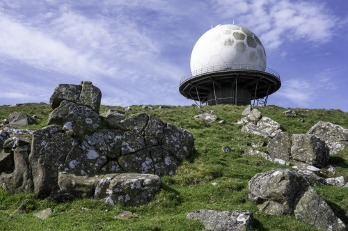

# Name: Mining, Titterstone Clee Hill

TBD

# Name: Hill Fort, Titterstone Clee Hill

TBD
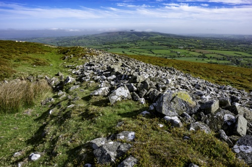

# Name: Cairn, Titterstone Clee Hill

TBD
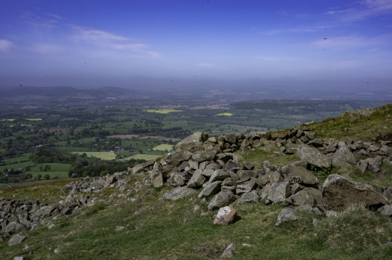

# Name: Giant's Chair, Titterstone Clee Hill

TBD
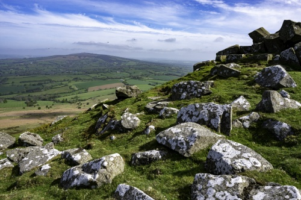

# Name: Quarry, Titterstone Clee Hill

TBD
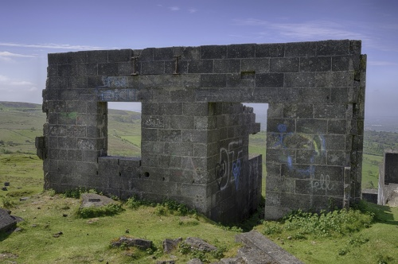

# Name: Quarry, Titterstone Clee Hill

TBD
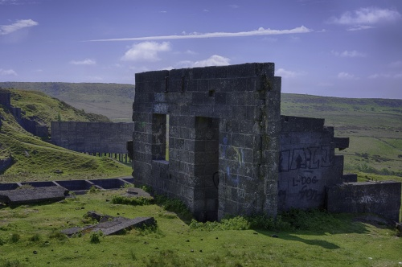

# Name: Quarry, Titterstone Clee Hill

TBD
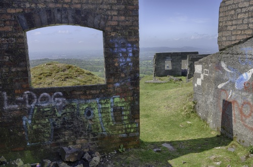

# Name: Quarry, Titterstone Clee Hill

TBD
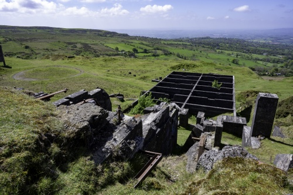

# Name: Quarry, Titterstone Clee Hill

TBD

# Name: Quarry, Titterstone Clee Hill

TBD

# Intro: The Stiperstones

TBD

# Name: The Stiperstones

View walking down from Blakemoorgate to Snailbeach.
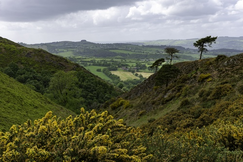

# Name: The Stiperstones

View walking down from Blakemoorgate to Snailbeach.
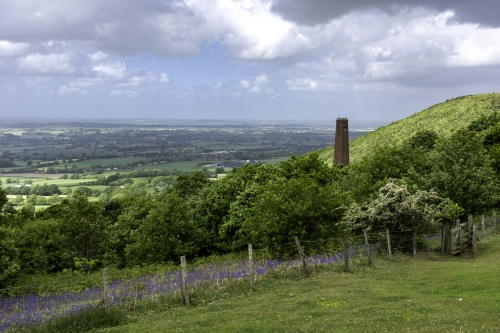

# Name: The Stiperstones - Nipstone Rock

TBD
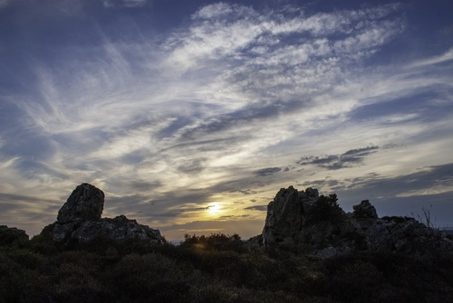

# Name: The Stiperstones

TBD
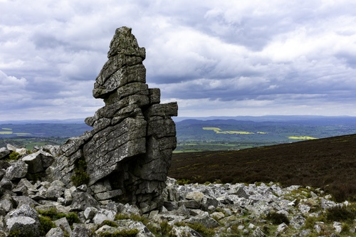

# Name: The Stiperstones

TBD
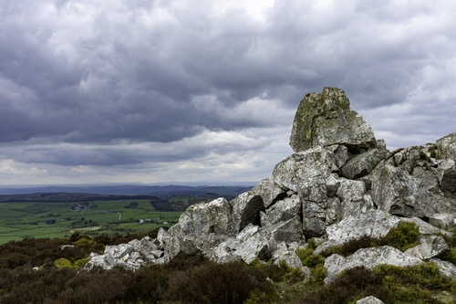

# Name: The Stiperstones

TBD

# Name: View from the Stiperstones

TBD

# Name: The Stiperstones

TBD

# Name: The Stiperstones

TBD

# Name: The Stiperstones

TBD

# Name: The Stiperstones

TBD

# Name: The Stiperstones

TBD

# Name: The Stiperstones

TBD

# Name: The Stiperstones

TBD

# Name: The Stiperstones

TBD

# Name: The Stiperstones

TBD

# Name: The Stiperstones

TBD

# Name: The Stiperstones

TBD

# Name: The Stiperstones

TBD

# Name: The Stiperstones

TBD

# Name: The Stiperstones

TBD

# Name: The Stiperstones

TBD

# Intro: Willstone Hill

On Willstone Hill are the Battle Stones.

# Name: The Battle Stones, Willstone Hill

TBD

# Intro: The Wrekin

The Wrekin rises to a height of 1,335ft above the Shropshire plain.

There is an Iron Age hill fort on the summit almost 8 ha (20 acres) in size.

The Wrekin is the subject of a well-known legend in Shropshire folklore concerning a giant called Gwendol Wrekin ap Shenkin ap Mynyddmawr with a grudge against the town of Shrewsbury.

# Name: The Wrekin

At sunrise.

# Name: The Wrekin

At sunrise.

# Name: The Wrekin

At sunrise.

# Name: The Wrekin

At sunrise.

# Name: The Wrekin

At sunrise.

# Name: The Wrekin

TBD

# Name: The Wrekin

TBD

# Name: The Wrekin

TBD

# Name: The Wrekin

TBD

# Name: The Wrekin

View of the Wrekin from the road bridge over the River Severn at Cressage.

