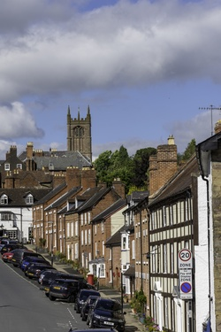
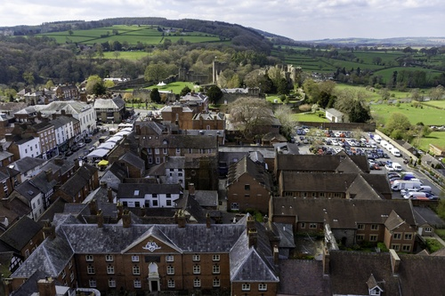
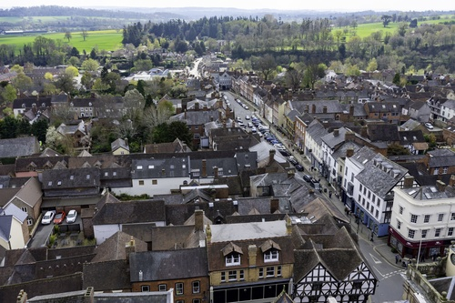
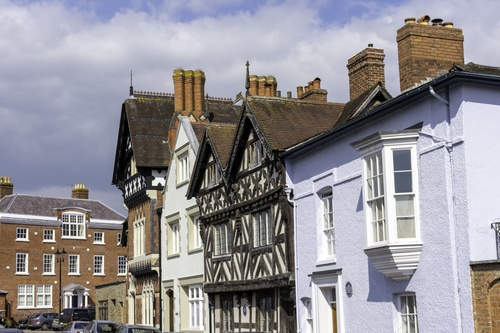
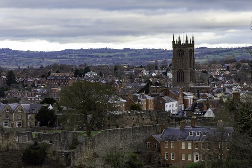

# Name: View from Ludford Bridge

View of Ludlow from Ludford Bridge.

# Name: View from top of Church Tower

View of the town from the top of the church tower (St Laurence).  The tower is 135 feet (41 metres) high and the climb is 200 steps.

# Name: View from top of Church Tower

View of the town, the castle and Whitcliffe Common from the top of the church tower (St Laurence).

# Name: View from top of Church Tower

View of Broad Street from the top of the church tower (St Laurence).

# Name: Dinham

Dinham

# Name: Dinham

Dinham

# Name: Broad Street

Broad Street

# Name: Broad Street

Broad Street

# Name: View from Whitcliffe Common

View of the town from Whitcliffe Common.

# Name: View from Whitcliffe Common

View of the town from Whitcliffe Common.

# Name: View from Whitcliffe Common

View of the town from Whitcliffe Common.

