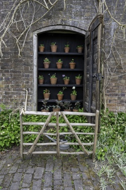
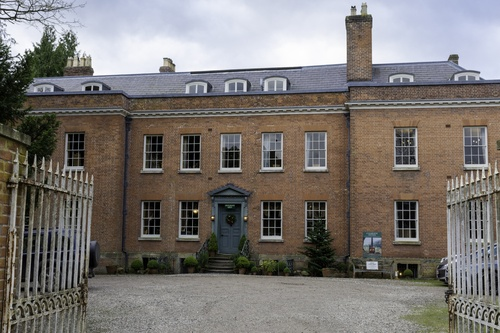
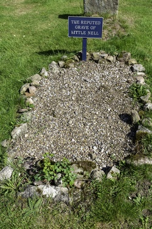
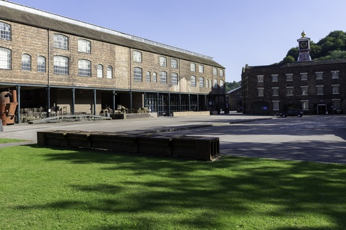

# 2022

## Name: Attingham Christmas Trees

TBD

## Name: Attingham Christmas Trees

TBD

## Name: Fire Insurance Plaque, Bitterley

The fire insurance plaque on Bitterley Court.

## Name: Stone Cross, Burford

The churchyard cross is medieval.  The upper part was restored in 1867 and incorporates carvings of the crucifixion and the nativity.

## Name: Ironbridge Tolls

The iron bridge tolls.

## Name: Sabrina Statue, Shrewsbury

This statue is of Sabrina, the fabled goddess of the RIver Severn.  Carved from stone by Peter Hollins in 1846 and donated by the Earl of Bardford to the people of Shrewsbury in 1879.  The folowing text is inscribed on the base of the statue:

Sabrina fair, listen where thou art sitting under the glassie, cool, translucent wave, in twisted braids of lilies knitting the loose train of thy amber-dropping hair; listen for dear honour's sake, goddess of the silver lake, listen and save.

## Name: Coalbrookdale

TBD

## Name: Coalbrookdale

TBD

## Name: Coalbrookdale

TBD

## Name: Coalbrookdale

TBD

## Name: Coalbrookdale

TBD

## Name: Rosehill House, Coalbrookdale

TBD

## Name: Rosehill House, Coalbrookdale

TBD

## Name: Bowyer Yard Lime Kilns, Ironbridge

Limestone has been quarried in the area of Ironbridge (Benthall Edge) since medieval times, but it became immensely important during the 18th and 19th Centuries.  Whilst much the best limestone was transported to the ironmaking furnaces on the north side of the river, other grades of limestone was processed in limekilns at the eastern end of the woods, south of the river.

The limekilns are one of the best preserved monuments of an industry which was once of great importance in the Gorge.  A steep inclined plane linked the kilns with the quarries on Benthall Edge.

It is known that the kilns closed sometime in the mid-19th Century and then had a brief commercial revival in the 1920s and 1930s when perhaps the economics of extraction became favourable again.

In 2010 the trust rasied £70,000 to repair the lime kilns. Sections of the top and  corner were rebuilt as was the buttress. the remaining parts where repointed and a new saftey fence was erected.

## Name: Ironbridge

TBD

## Name: Power Station - Turbine Hall, Ironbridge

The turbine hall of the former pwer station.  The cooling towers were demolished in November 2019 and the chimney in August 2021.  This is the former power station as of May 2022, taking on a walk done as part of the Ironbridge Walking Festival.

## Name: Merrythought, Jubilee Bear

The Merrythought factory at Ironbridge produced a Teddy Bear for the Platinum Jubilee.

## Name: Lydebrook Dingle, Coalbrookdale

Sandstone was quarried in Lydebrook Dingle (up the gorge from Coalbrookdale) during the Industrial Revolution of the18th Century for the Coalbrookdale ironworks, it was used for sand castings to make iron moulds.

## Name: Benthall Hall 1

TBD

## Name: Benthall Hall 2

TBD

## Name: Benthall Hall 3

TBD

## Name: Benthall Hall 4

TBD

## Name: Bus Shelter, Cross Houses

TBD

## Name: Workhouse, Tiddicross

Tiddicross Field, situated to the west of Wrockwardine on the road to Charlton, was purchased for charitable purposes in 1657, when the rents of the property, upon which a house and barn were later built, were divided annually between the poor of the parish. The cost of relieving local poverty rose rapidly during the 17th and 18th Centuries and in 1782 the parish authorities were forced to rent a cottage in which to house the local poor.  By 1801, a new parish workhouse was deemed necessary and a purpose-built facility was constructed on Tiddicross Field.

## Name: Blossom, Benthall Hall

TBD

## Name: Blossom, Benthall Hall

TBD

## Name: Blossom, Benthall Hall

TBD

## Name: Patten's Quarry, Ironbridge

A limestone quarry named after John Patten, lime master, who worked out of Bowyer's Yard.

## Name: Blossom, Ironbridge

TBD

## Name: Benthall Edge Woods, Ironbridge

TBD

## Name: War Memorial, Shifnal

TBD

## Name: Old Idsall House, Shifnal

Old Idsall House is believed to be the oldest house in Shifnal and to have survived the fire of 1591.  From aboit 1760, this was Shifnal's first post office.

## Name: Puleston Cross, Newport

The Puleston Cross is the original Market or 'Butter' cross in Newport, it was put up in c.1280 in memory of Sir Roger de Pyvelesdon, who died in 1272.  The cross was probably mutilated during the Civil War.

## Name: Sundial, Wrockwardine

The sundial, which dates from 1750 AD,  is in bronze, on a cast iron fluted column, and stands on a circular stone base.

## Name: The Old Blacksmith Shop and War Memorial, Wrockwardine

The War Memorial and the Old Blacksmith's shop in Wrockwardine, the latter dates from the 18th Century.

## Name: The Old Vicarage, Wrockwardine

The Old Vicarage in Wrockwardine was built by Thomas Ore (a wealthy brewer and benefactor of the parish) in the late 18th Century.

## Name: Flood Barriers, Ironbridge

In February 2022, the flood barriers are put up - it was thought that the river might breach the barrier this year, but it didn't.

## Name: The Holy Grail & The Da Vinci Code, Hodnet

In 2006, the interior of Hodnet church was damaged by people apparantly seeking clues as to the whereabouts of the Holy Grail.  The damage was caused to stonework beneath the stained glass window depicting the Four Evangelists, this window shows St John with an apparently feminine appearance - this is one of the major themes of the best-selling novel by Dan Brown.  Not only does the figure appear to be a woman, but the figure is wearing a woman's gown and is holding a golden chalice (the traditional depiction of the Holy Grail).

On 25/08/2006, the BBC reported that:

*A number of holes were chiselled into the stonework of the Grade I-listed 14th Century church in the nave, near the choir vestry door and by a stained glass window.*

The article also commented that:

*The church also features strongly in The Chalice of Magdalene, written by "historical detective" Graham Phillips.*

*In it, his search for the Holy Grail leads him to St Luke's and the stained glass window. The story also features on the author's website.*

The reality is that Shropshire Antiquarian Thomas Wright (1810 to 1877) claimed to have the Chalice of Magdalene.  In the spirit of Arthurian legend, he hid it at Hawkstone Park (as the owner was building a park and garden at the time) and left a series of clues to its whereabouts.  The chalice was hidden in one of four statues depicting a bull, a lion, an angel and an eagle (the symbols for the four gospels) - the statues were placed in a cavern in the White Cliff at Hawkstone Park.  In the window above the figures are the four symbols - the window is dated 1846 and was sponsored by Thomas Wright.  In the 1920s, an attempt was made to move the statues and in the process the eagle (St John) statue was broken revealing a cavity containing a small stone cup.  The cup was confirmed by the British Museum as being a green alabaster ointment or scent jar from the 1st Century AD.

# 2021

## Name: Mary Webb Memorial, Much Wenlock

Mary Webb’s formative years were spent in Much Wenlock and its people and landscape were the source of some of her literary inspiration.  In 2000, the Mary Webb Society commissioned a bronze plaque by local artist Humphrey Hallward which is sited on a piece of Wenlock stone at the rear of the Guildhall.

## Name: Yew Tree, Church Preen

The sign by this tree reads "This Yew is believed to have been planted approx 457AD and thought to be the oldest tree in Europe".

## Name: Ironbridge

TBD

# 2020

## Name: The Ironbridge at Christmas, Ironbridge

TBD

## Name: Ludford Water Mill, Ludlow

Ludford Mill is a 16th Century Water Mill (and now a private dwelling).

In front of Ludford Mill is a stepped structure.  This houses the Ludlow Hydro Co-Operative's Archimedes Screw installation.  It was completed in 2016 at a cost of £400,000 (financed by a community body supported by 170 local people and others committed to eco-friendly electricity production).  The Screw harnesses the power of the millrace to generate electricity, enough to light a bulb in every house in Ludlow and Ludford year round.

Whenever the river level is high enough, water is channelled into the top of the Screw, most of the generated electricity is fed into the National Grid.  The Screw design was chosen as it is the most wildlife friendly design.

## Name: Horseshoe Weir, Ludlow

The medieval weir at Ludford Mill (River Teme, Ludlow) is Grade II listed.  There is evidence suggesting that the weir had been built by 1241 AD.  It was built to steady the flow of water to Ludford Mill.  The weir was restored in 2002.

The name Ludlow means, in Old English, loud or noisy (hlud) - referring to the River Teme - and tumulus or hill (hlaw).

## Name: Yew Tree, Baschurch

The yew tree in the churchyard at Baschurch is hollow inside.  It is thought to date from the 6th Century.

## Name: The Railway, Broseley

Broseley developed as an industrial area due to the abundance of coal, clay, iron ore and limestone easily workable in one area, also the woods provided charcoal and the River Severn transport.  In fact, the mines in Broseley and the adjoining parish of Benthall became of national importance in the seventeenth century.

This industrialisation drove innovation - a document of 1605 refers to a railway line from Birch Leasows, Broseley to the Calcutts, this is only the second railway for which evidence survives in England (making it one of the oldest railways in England).  A railway at the time would have horse drawn wagons on flanged wheels (meaning that greater loads could be moved with the same effort).

## Name: Yew Tree, Norbury

This yew tree is said to be one of the largest and one of the oldest in the UK, it has a girth of about 10m / 33ft and is estimated to be 2,700 years old.

## Name: Bishop's Castle

View of Bishop's Castle from the church.

## Name: Bishop's Castle

TBD

## Name: The Boat Inn, Jackfield

The Boat Inn in Jackfield keeps a record of flood levels on its door.  The highest record was set at 19 feet and six inches (5.97m) on 1st November 2000.  Other records have been set at 19 feet and five inches (5.95m) on 10th February 1946 and at 19 feet and one inch (5.8m) on 21st March 2020 and due to the Covid-19 epidemic, the inn is still undergoing repairs in August 2020, serving food and drink from a caravan.

## Name: Canal Basin, Coalport

The Canal Basin at the bottom of the Hay Inclined Plane - the Coalport Canal was a short stretch of canal linking the Coalport China Works, the foot of the Inclined Plane and the River Severn.

## Name: Pony, The Long Mynd

Wild ponies have lived on the Long Mynd for centuries.

## Name: War Memorial, Ironbridge

TBD

## Name: Early Morning Shadow, Ironbridge

Early morning shadows on the Iron Bridge and the Toll House.

## Name: Early Morning, Ironbridge

TBD

## Name: Stone Cross, Alberbury

Situated by the church at Alberbury, a medieval churchyard cross (most likely 15th Century) which has been converted into a sundial, probably in the 17th Century.

## Name: Memorial by the Church, Church Pulverbatch

The memorial reads:

In memory of 2nd Lt Arthur D Brody of Des Moines Iowa who died within sight of this spot 25th June 1944 piloting USAAF P-47 41-6231 of the 495th Fighter Training Group stationed at Atcham

## Name: The Gargoyles on the Church, Battlefield

The Gargoyles on the church at Battlefield.

## Name: Yew Tree, Claverley

The yew tree in the churchyard at Claverley has been officially aged by botanist and television presenter Sir David Bellamy, is believed to be one of the oldest in the county at 2,500 years old.  It was trimmed in 2013 to prevent damage to the church, as the tree is listed permission had to be provided by the council.

## Name: Yew Tree, Claverley

The yew tree in the churchyard at Claverley has a trunk which is hollow inside and has a circumference of more than 29ft.

## Name: Claverley

The village of Claverley near Bridgnorth.

## Name: Claverley

The village of Claverley near Bridgnorth.

## Name: Claverley

The village of Claverley near Bridgnorth.

## Name: Claverley

The village of Claverley near Bridgnorth.

## Name: Blakemoorgate Cottages

Blakemoorgate Cottages are a pair of restored miners' cottages on The Stiperstones above Snailbeach.  They are small squatter cottages built by the miners themselves who were allowed to stay, it is said, if they could build the chimney overnight and have smoke coming out of it by morning.  The building of the rest of the cottage could follow in slower time, a small rent was then paid to the estate.

## Name: Blakemoorgate Cottages

Blakemoorgate Cottages are a pair of restored miners' cottages on The Stiperstones above Snailbeach.  It is quite a walk up to these cottage from the mine and other facilities like the church at Snailbeach.

## Name: Lead Mine, Snailbeach

The entrance to Snailbeach lead mine.

## Name: Apley Woods, Telford

Apley Woods is a 19th Century landscaped 56 acre woodland near Telford.

## Name: Apley Woods, Telford

Apley Woods is a 19th Century landscaped 56 acre woodland near Telford.

## Name: Apley Woods, Telford

This sculpture called "Energy Rising" is located in the heart of the woodland.

It is believed to symbolise lava emerging from the earth.

## Name: Flooded Fields, Cressage

In the late Winter / early Spring of 2020 there was severe flooding in Shropshire - this picture shows the flooding (River Severn at Cressage).

## Name: Tree in Flood Water, Atcham

In the late Winter / early Spring of 2020 there was severe flooding in Shropshire - this picture shows a tree in the flood water at Atcham.

## Name: Flooded Parkland, Attingham Park

In the late Winter / early Spring of 2020 there was severe flooding in Shropshire - this picture shows the parkland at Attingham Park.

## Name: The Royal Oak, Cardington

A free house since circa the 15th Century, the Royal Oak is reputed to be the oldest continuously licensed pub in Shropshire.

## Name: Telephone Box, Cardington

The old telephone box has been adopted by the village and now contains information panels about the history of the Shropshire and the village itself.

## Name: Ironbridge

TBD

## Name: Ironbridge

TBD

## Name: Ironbridge

TBD

## Name: 2 King St, Ludlow

This address was used as the headquarters of Newsfield Ltd from 1984 to 1989.

Newsfield Ltd published two of the most influential video games magazines of that era - Crash and Zzap!64 for the ZX Spectrum and Comodore 64 respectively. 

## Name: 4 Brand Ln, Ludlow

Mary Edwards, thought to be the first female computer, lived and worked at this address.  Paid directly by the Board of Longitude and working to the Astronomer Royal, Edwards calculated the position of the sun, moon and planets at different times of day for annual nautical almanacs used for navigation at sea.

Edwards did this from 1773 to her death in 1815.

## Name: Dinham House, Ludlow

Lucien Boneparte (brother of Napoleon) was held as a prisoner of war at Dinham House for a few months in 1811 while the war between Britain and France was ongoing.

# 2019

## Name: Grave of Ebenezer Scrooge, Shrewsbury

Shrewsbury was used for filiming the 1984 version of A Christmas Carol (Shrewsbury was one of Dickens's favourite places).

The grave of Ebenezer Scrooge is still in the graveyard of St Chad's.

## Name: Stone Cross, Ightfield

A preaching cross in the churchyard - the present shaft and cross is probably Victorian (most likley installed when the church's chancel was rebuilt in 1865).  The base most likely dates from Saxon times.

## Name: Grave of Little Nell, Tong

The reputed grave of Little Nell, the character in the Charles Dickens novel The Old Curiosity Shop - in 1910 the verger created a false entry in the parish register to state that Nell Gwyn was buried at Tong.  Although fake and a grave for a fictional character, the stunt attracted many visitors.

## Name: Stone Cross, Bitterley

Dating from the 14th Century, a stone cross in the churchyard of St Mary's church at Bitterley.  This one is thought to be the finest surviving stone cross in the county.

## Name: Coalbrookdale

TBD

## Name: Coalbrookdale

TBD

## Name: Coalbrookdale

TBD

## Name: Coalbrookdale

TBD

## Name: Coalbrookdale

TBD

## Name: Coalbrookdale

TBD

## Name: Sweet Pea Festival, Wem

The Eckford Sweet Pea Society of Wem held a festival each July from 1989 to 2019.  The show was held in celebration of Henry Eckford - Eckford was a Scottish horticulturist and reputedly the most famous breeder of sweet peas.  In 1888 he moved to Wem and it was in Wem that he perfected the breeding of his Grandiflora sweet peas.  He is buried at the Whitchurch Road Cemetery in Wem.

## Name: The Yew Tree, Hope Bagot

An ancient yew tree, thought to be between 1000 and 2000 years old.

# 2017

## Name: The Bog Centre

The Bog Visitor Centre is located in the shadow of the Stiperstones.  It is the former Victorian school and is one of the few remaining buildings of a lost lead and barytes mining village.

# 2013

## Name: Sabrina, Shrewsbury

Hafren is the Welsh Goddess of the river Severn (Latin name is Sabrina).

The pleasure craft called Sabrina provides boat trips in Shrewsbury from the Victoria Quays round the Severn loop to the English bridge and back.

# 2005

## Name: Conservatory at Sunnycroft, Wellington

Built in 1899AD, the conservatory is now one of only two known examples of its kind still standing, built by R Halliday & Co.  The Halliday conservatory would have been a state of the art horticultural as well as architectural masterpiece, a statement of great pride for Mrs Slaney (Sunnycroft's owner) who grew prize-winning exotic ferns (most likely in the conservatory).  She is listed as a member of the Shropshire Horticultural Society in 1906 and programmes for the Royal Agricultural Society’s (Shrewsbury) show and Shrewsbury Flower Show of 1914 are in Sunnycroft’s archive. Mrs Slaney’s gardener Mr Stevenson regularly displayed and won first and second prizes for exotic ferns in August each year at the Shropshire Horticultural Association Show, as recorded in the Gardener’s Chronicle in 1894, 1897, 1900, 1901 and 1906.

