# Name: General View

TBD

# Name: Boundary Stone

The stone that marks the boundary of the parishes of Holy Cross & St Giles, Abbey Foregate and St Julian, Shrewsbury, it formerly stood on the old English or stone bridge demolished in 1774.
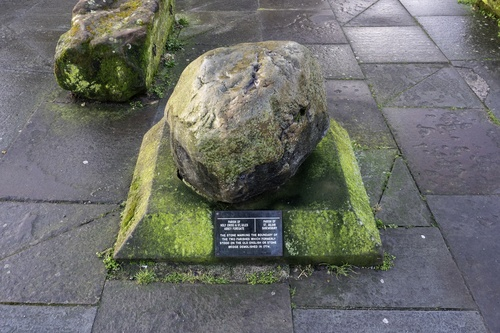

# Name: General View

TBD

# Name: General View

TBD

# Name: Unknown Passage

TBD

# Name: Claremont Hill

TBD
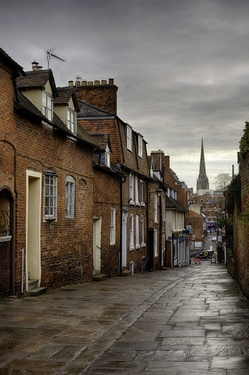

# Name: Claremont Hill

The Old Parsonage or Manse This house, built in 1689 for a Shrewsbury Draper's family stands on the site of one clearly shown on the Burleigh map of 1575, which it probably incorporates. When the new king George I gave his protection to the Unitarian Church in the High Street after its destruction in 1715, this house also became the Minister's manse until thr 1920s as well as the church's school to provide non-Trinitarian education. Charles Darwin along with his sister were pupils here in 1827 under the Reverend Augustus Chase before hew went on to the Schools, Shrewsbiry (now the library). The poet ST Coleridge, though staying with Hazlitt in Wem, was associated with the house when a candidate for the ministry here, only to be granted a pension to pursue his radical policies and philosphy by thethen patron Josiah Wedgewood, Darwin's grandfather. Religious mobs damaged the house several times during the 1700s. It received the award of the Shrewsbury Civic Society for its restiration in the early 1950s.
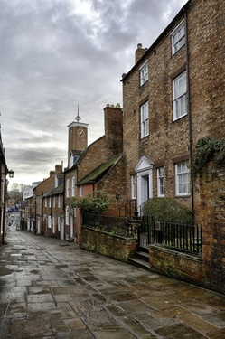

# Name: The Square

TBD
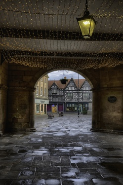

# Name: The Square

TBD

# Name: St Alkmonds Place

TBD

# Name: Milk Street

TBD
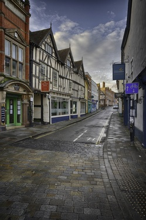

# Name: Milk Street

TBD
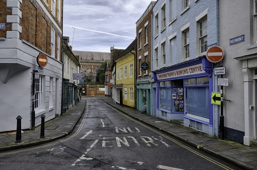

# Name: Church Street

TBD

# Name: Unknown Passage

TBD
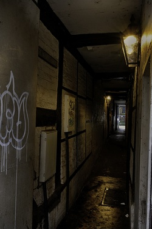

# Name: Shrewsbury Cakes

This shop occupies the site of a building where Pailin first made the unique Shrewsbury cakes to his original recipe in the year 1760. 'Oh! Pailin. Prince of Cake Compounders the mouth liquefies at the very name. But there...' see Ingoldsby Legends.

# Name: Fish Street

TBD

# Name: Wyle Cop

TBD
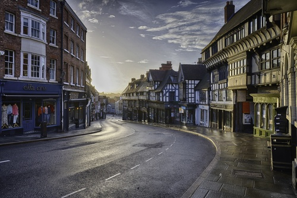

# Name: Wyle Cop

TBD
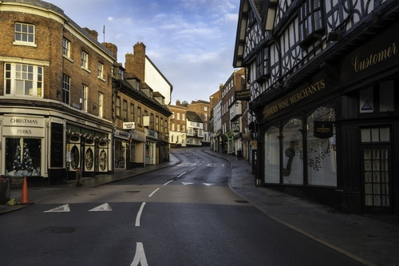

# Name: The Bear Steps

TBD
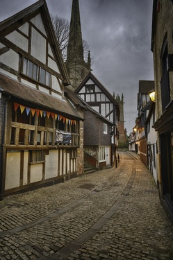

# Name: Wyle Cop

TBD
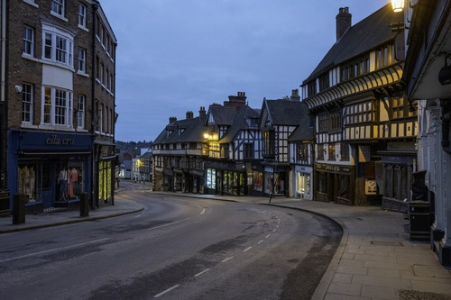

# Name: Barracks Passage

TBD

# Name: Golden Cross Passage

TBD

# Name: View from Greyfriars Bridge

TBD
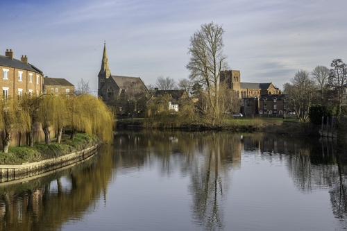

# Name: The Bear Steps

Bear Steps (1358-1359 AD) itself is named for The Bear Inn Pub which sat on the corner of Fish Street and Grope Lane.

# Name: The Bellstone

A young Charles Darwin’s first introduction to geology was a granite boulder, called the Bellstone, situated in Morris Hall courtyard in Shrewsbury town centre.

As a child, Darwin was told this sort of stone was only found much further north in Cumbria or Scotland and there was no explanation for how it ended up in Shropshire. It was only when he studied geology at Edinburgh that Darwin learned that during the last ice age moving glaciers had transported massive rocks across the country.

Shropshire has rocks from more periods of geology than anywhere else in the world, and it was The Bellstone that inspired a young Charles Darwin. The glacial meres and scars that shaped the Shropshire landscape and deposits they left (and the Bellstone in particular) convinced Darwin that the world is much older than the popular thinking at the time.

# Name: Abbey Church

The Abbey Church

# Name: Abbey Church

The Abbey Church

# Name: Abbey Church

The Abbey Church

# Name: Abbey Church

The Abbey Church

# Name: Abbey Church

The Abbey Church

# Name: Abbey Church

The Abbey Church

# Name: Abbey Church

The Abbey Church

# Name: Abbey Church

The Abbey Church

# Name: Abbey Church

The Abbey Church

# Name: Abbey Church

The Abbey Church

# Name: Fish Street

Fish Street

# Name: Fish Street

Fish Street

# Name: Church Street

Church Street

# Name: Bear Steps

The Bear Steps area encompasses many of Shrewsbury’s most historic streets.  Historically, the area was filled with traditional traders which gave the surrounding streets many of their names; Butcher Row, Fish Street, Grope Lane.  Bear Steps itself is named for The Bear Inn Pub which sat on the corner of Fish Street and Grope Lane.  Although local legend claims the area was historically home to one of Shrewsbury’s bear pits. 

At the centre of Bear Steps sit two of Shrewsbury’s five churches; St Alkmund’s and St Julian’s. Founded in 902, St Alkmund’s Church stands at the highest point in town.  St Julian’s tower dates from the 12th century, and the present nave was designed by Thomas Farnolls Pritchard who also designed the Iron Bridge at Telford.

# Name: The Lion

The main part of the present building dates from 1778, but there is evidence to suggest that there was coaching inn on the site prior to 1553 (known as the Red Lion).  The Lion has a history of holding events for the local nobility and gentry including Darwin (who arrived late one night just after his 5 year voyage on HMS Beagle), Disraeli and King William IV entertained by the likes of Charles Dickens and Paganini.

# Name: The English Bridge

The English Bridge

# Name: Council House Gatehouse and Gateway

The house is probably early 16th Century, and the gatehouse is dated 1620.

# Name: Gateway of the Shoemakers’ Arbour

Originally erected on Kingsland in 1679 by the Shoemakers; Guild, and removed to the present site in 1877.  The figures represent Crispin and Crispian - the partron saints of shoemakers.  The gateway is built of stone, and bears the date of 1679 and the initials, H. P. and E. A.; the wardens of the Shoemakers’ guild at that time.

# Name: Wyle Cop

65-69 Wyle Cop - late 15th Century, probably originally a dwelling.  Wyle Cop - Wyle is medieval English for hill, and Cop means ‘top of’.

# Name: Wyle Cop

65-69 Wyle Cop - late 15th Century, probably originally a dwelling.  Wyle Cop - Wyle is medieval English for hill, and Cop means ‘top of’.

# Name: St Chads, new Church

The new St Chads church

# Name: Lord Hill Column

The Lord Hill column

# Name: The Square

The Square

# Name: The Abbey Church

The Abbey Church

# Name: The Abbey Church

The Abbey Church

# Name: The Abbey Church

The Abbey Church

# Name: The Abbey Church

The Abbey Church

# Name: The Old Town Hall

The Old Town Hall

# Name: The Market Hall

The Market Hall

# Name: The Market Hall

The Market Hall

# Name: The Market Hall

The Market Hall

# Name: War Memorial

The memorial was designed by George Hubbard FSA FRIBA, of Hubbard and Moore, around a central figure by Allan Gairdner Wyon FRBS. The monument was built by Messrs Kirkpartrick and the statue was cast by A B Burton, of Thames Ditton. The memorial was unveiled on 29 July 1922 by George Herbert, 4th Earl of Powis, the Lord Lieutenant of Shropshire, in a ceremony presided over by the Right Reverend John Kempthorne, the Bishop of Lichfield.

The centre of the rotunda is occupied by a bronze statue of Saint Michael depicted as the field commander of the Army of God, in a full set of Gothic plate armour and holding a pennanted lance. His right hand is held out in benediction, he has a halo in the shape of a solar cross and he is framed by a large pair of feathered wings.

# Name: The Loopy Shrew

The Loopy Shrew

# Name: Unknown

Unknown

# Name: Buskers

Buskers

# Name: Clive of India

Clive of India

# Name: High St

High Street

# Name: Milk St

Milk Street
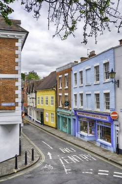

# Name: Old St Chad's Door

Old St Chad's Door

# Name: Old Market Hall

Old Market Hall

# Name: Old Market Hall

Old Market Hall

# Name: View from Lord Hill Column

View of Shrewsbury from the top of the Lord Hill column - the column is 133ft tall and there are 172 steps.

# Name: Abbey Foregate

View of Abbey Foregate and the Abbey from the top of the Lord Hill column - the column is 133ft tall and there are 172 steps.

# Name: The Dingle

The Dingle

# Name: The Dingle

The Dingle

# Name: The Mardol Dragon

The Mardol Dragon - not actually part of the original building, but added in the 20th Century!

# Name: TBD

TBD

# Name: TBD

TBD

# Name: TBD

TBD

# Name: TBD

TBD

# Name: Statue of Hercules

The statue is a lead copy of the Farnese Hercules on a stone pedestal.  It was created in the 18th Century and is possibly by John Nost, it was originally at Condover Hall.  The inscription on plinth reads: Copy of the statue executed by the Athenian Sculptor Glycon and known as the Farnese Hercules.

# Name: St John's Hill

St John's Hill

# Name: St John's Hill

St John's Hill

# Name: Passage

Passage (off Fish St)

# Name: General View

TBD

# Name: General View

TBD

# Name: General View

TBD

# Name: General View

TBD

# Name: General View

TBD

# Name: General View

Preaching Cross in the grounds of St Giles church.

# Name: General View

TBD
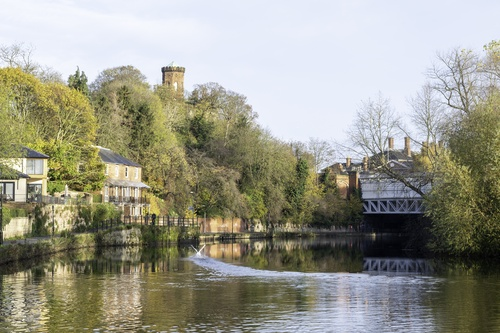

# Name: General View

TBD

